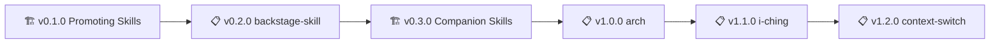

# Skills Project

**Collection of OpenClaw skills**

---

## What's Here

| Name | Description | Status |
|------|-------------|--------|
| **arch** | Architecture design exercises (collaborative diagrams before coding) | 📋 Backlog |
| **context-switch** | Conscious project/epic transitions with parity detection | 📋 Backlog |
| **design-discrepancy** | Compare reference docs with live systems (design vs implementation gaps) | 📋 Backlog |
| **find-books** | Search foundational/seminal books via Anna's Archive | 📋 Backlog |
| **i-ching** | I Ching divination (hexagrams, trigrams, oracles) | 📋 Backlog |
| **notify** | Presence-aware notifications (idle detection + channel routing) | 📋 Backlog |
| **[reminder-research](https://clawhub.com/skills/reminder-research)** | Process Apple Reminders with custom instructions | ⭐ Published |
| **reels-library** | Instagram reels scraping, transcription, and tagging | 🚧 In Progress |
| **roadmap** | Backstage roadmap management across projects | 📋 Backlog |
| **system-detective** | Auto-detect investigation context and route to correct tool | 📋 Backlog |
| **[token-management](https://clawhub.com/skills/token-management)** | Manage API tokens/credentials across projects | ⭐ Published |
| **use-for** | Skill suggester (meta-skill for skill discovery) | 📋 Backlog |

**Skill Statuses:**
- ⭐ **Published** - Available on ClawHub
- 🚧 **In Progress** - Active development
- 📋 **Backlog** - Planned, not yet started

---

## Project Policy

**How to work with skills:**

1. **Companion skills live in their projects** (librarian, backstage, etc.)
   - Symlinked into `~/.openclaw/workspace/skills/` for OpenClaw discovery
   - Versioning follows project roadmap
   - See `backstage/epic-notes/dealing-with-companion-skills.md`

2. **Standalone skills live here**
   - Self-contained (no external project dependency)
   - Can be published to ClawHub

3. **Private skills** (work-specific, NOT in git)
   - See `.gitignore` for exclusions
   - NOT publishable to ClawHub

4. **Adding new skills** - See `backstage/POLICY.md`

---

## Backstage

> 🤖
> | Backstage files | Description |
> | ---------------------------------------------------------------------------- | ------------------ |
> | [README](README.md) | Our project |
> | [CHANGELOG](backstage/CHANGELOG.md) | What we did |
> | [ROADMAP](backstage/ROADMAP.md) | What we wanna do |
> | POLICY: [project](backstage/POLICY.md), [global](backstage/global/POLICY.md) | How we go about it |
> | HEALTH: [project](backstage/HEALTH.md), [global](backstage/global/HEALTH.md) | What we accept |
>
> We use **[backstage protocol](https://github.com/nonlinear/backstage)**, v0.3.4
>
> 🤖

