```mermaid
graph LR
    A[🏗️ v0.1.0 Promoting Skills] --> B[📋 v0.2.0 backstage-skill]
    B --> C[🏗️ v0.3.0 Companion Skills]
    C --> D[📋 v1.0.0 arch]
    D --> E[📋 v1.1.0 i-ching]
    E --> F[📋 v1.2.0 context-switch]
```

# Skills Project

**Collection of OpenClaw skills**

---

## What's Here

<table>
<tr>
<th align="left">Name</th>
<th align="left">Description</th>
<th align="left">Status</th>
</tr>
<tr valign="top">
<td><strong>arch</strong></td>
<td>Collaborative architecture design via mermaid diagrams. Design before coding through iterative AI refinement. Triggers: 'design architecture for X', 'let's architect Y', 'vamos desenhar fluxo de Z', 'before coding let's map this'. Use for: system architecture, API design, database models, workflows, infrastructure planning.</td>
<td>stable</td>
</tr>
<tr valign="top">
<td><strong>context-switch</strong></td>
<td>Conscious project/epic transitions with HEALTH checks. Triggers: 'bom dia' (morning load main+wiley M-F), 'vamos trabalhar no X' (switch to project/epic), 'boa noite' (evening close + victory lap). Prevents context confusion, enforces HEALTH rituals, detects gaps between docs and reality.</td>
<td>stable</td>
</tr>
<tr valign="top">
<td><strong>design-discrepancy</strong></td>
<td>Compare reference docs (Figma, specs) with live system via Chrome Relay. Surface design vs implementation gaps for QA reports. Triggers: 'compare X with Y', 'check discrepancies', 'design vs implementation', 'Figma vs live site'.</td>
<td>stable</td>
</tr>
<tr valign="top">
<td><strong>find-books</strong></td>
<td>Search foundational/seminal books on topics via Anna's Archive. Triggers: 'procura livros sobre X', 'find canonical works on Y', 'livros fundacionais/seminais'. Returns piracy links (fuck copyright hypocrisy). Use for: discovering authoritative sources, building reading lists, research foundation.</td>
<td>stable</td>
</tr>
<tr valign="top">
<td><strong>i-ching</strong></td>
<td>I Ching divination (hexagrams, trigrams, oracles). Companion, not fortune-teller—reflects what you know but can't see. Triggers: 'hexagrama X', 'I Ching pergunta Y', 'trigrama acima/abaixo', 'moedas'. Methods: hexagram number, trigram pair, coin throws (with changing lines). Philosophy: 'muito na chincha' (deeply aligned, profoundly useful).</td>
<td>stable</td>
</tr>
<tr valign="top">
<td><strong>notify</strong></td>
<td>Detect user presence (idle/active) and choose notification channel. Triggers: 'me avisa quando X', 'let me know when Y', 'lmk Z'. Monitors task completion, notifies via Telegram (away) or in-chat (active). Uses macOS ioreg for idle detection.</td>
<td>stable</td>
</tr>
<tr valign="top">
<td><strong><a href="https://clawhub.com/skills/reminder-research">reminder-research</a></strong></td>
<td>Process Apple Reminders. Smart research: custom instructions (book + web search constraints), list-based defaults (claw=system solutions, shopping=price comparison, generic=how-to tutorials). Result tracking with 💎 signifier. Triggers: reminders without notes, heartbeat automated processing.</td>
<td>published</td>
</tr>
<tr valign="top">
<td><strong>roadmap</strong></td>
<td>Manage backstage roadmaps across projects. Add items, create epics, groom with emoji shortcuts. Triggers: 'add to roadmap X', '[project]: add roadmap item Y', 'merge 5️⃣ on 6️⃣', 'move 8️⃣ before 7️⃣'. Tracks main + project-specific roadmaps. Use for: epic planning, priority management, roadmap grooming.</td>
<td>stable</td>
</tr>
<tr valign="top">
<td><strong>system-detective</strong></td>
<td>Auto-detect investigation context and route to right tool. Triggers: 'investiga X', 'consulta Y', 'vê Z', 'sniff', 'inspeciona'. Decision tree: Jira → jira-check.py, URLs → web-fetch/browser, systems → exec/process, topics → librarian. Reduces tool selection overhead.</td>
<td>testing</td>
</tr>
<tr valign="top">
<td><strong><a href="https://clawhub.com/skills/token-management">token-management</a></strong></td>
<td>Centralized API token management workflow. Store tokens in .env with expiration dates, test permissions via script battery, document capabilities in connections/, set calendar renewal reminders. Prevents re-asking for credentials, ensures token security, tracks expiration.</td>
<td>published</td>
</tr>
<tr valign="top">
<td><strong>use-for</strong></td>
<td>Meta skill: Scans all SKILL.md frontmatter descriptions and suggests which skill helps with user's current task/struggle. Triggers: 'how do I...?', 'is there a skill for X?', repeated failed attempts, uncertainty. Returns top 3 matches with name + description. Reduces skill discovery overhead.</td>
<td>stable</td>
</tr>
</table>

## Companion Skills (belong to other projects)

<table>
<tr>
<th align="left">Name</th>
<th align="left">Description</th>
<th align="left">Status</th>
</tr>
<tr valign="top">
<td><strong><a href="https://clawhub.com/skills/backstage">backstage</a></strong></td>
<td>Manage backstage workflow in projects (ROADMAP, POLICY, HEALTH, CHANGELOG). Triggers: 'backstage start', 'vamos trabalhar no X', 'backstage health'. Installs protocol if missing, updates global rules, runs health checks, shows active epics. Use for: epic planning, project setup, quality enforcement, context switching. companion for <a href="https://github.com/nonlinear/backstage">backstage</a></td>
<td>published</td>
</tr>
</table>

---

## Project Policy

**How to work with skills:**

1. **Companion skills live in their projects** (librarian, backstage, etc.)
   - Symlinked into `~/.openclaw/workspace/skills/` for OpenClaw discovery
   - Versioning follows project roadmap
   - See `backstage/epic-notes/dealing-with-companion-skills.md`

2. **Standalone skills live here**
   - Self-contained (no external project dependency)
   - Can be published to ClawHub

3. **Private skills** (work-specific, NOT in git)
   - See `.gitignore` for exclusions
   - NOT publishable to ClawHub

4. **Adding new skills** - See `backstage/POLICY.md`

---

## Backstage

> 🤖
> | Backstage files | Description |
> | ---------------------------------------------------------------------------- | ------------------ |
> | [README](README.md) | Our project |
> | [CHANGELOG](backstage/CHANGELOG.md) | What we did |
> | [ROADMAP](backstage/ROADMAP.md) | What we wanna do |
> | POLICY: [project](backstage/POLICY.md), [global](backstage/global/POLICY.md) | How we go about it |
> | HEALTH: [project](backstage/HEALTH.md), [global](backstage/global/HEALTH.md) | What we accept |
>
> We use **[backstage protocol](https://github.com/nonlinear/backstage)**, v0.3.4
>
> 🤖

