```mermaid
graph LR
    A[🏗️ v0.1.0 Promoting Skills] --> B[📋 v0.2.0 backstage-skill]
    B --> C[📋 v1.0.0 arch]
    C --> D[📋 v1.1.0 i-ching]
    D --> E[📋 v1.2.0 context-switch]
    E --> F[📋 v1.3.0 design-discrepancy]
```

# Skills Project

**Collection of OpenClaw skills (public + private)**

---

## What's Here

**Public skills** (alphabetical):

- **arch** - Architecture design exercises (collaborative diagrams before coding)
- **backstage-skill** - Project context switching with HEALTH checks
- **context-switch** - Conscious project/epic transitions with parity detection
- **design-discrepancy** - Compare reference docs with live systems (design vs implementation gaps)
- **find-books** - Search foundational/seminal books via Anna's Archive
- **i-ching** - I Ching divination (hexagrams, trigrams, oracles)
- **librarian** - Book research via semantic search (requires external project)
- **notify** - Presence-aware notifications (idle detection + channel routing)
- **[reminder-research](https://clawhub.com/skills/reminder-research)** ⭐ - Process Apple Reminders with custom instructions
- **roadmap** - Backstage roadmap management across projects
- **system-detective** - Auto-detect investigation context and route to correct tool
- **[token-management](https://clawhub.com/skills/token-management)** ⭐ - Manage API tokens/credentials across projects
- **use-for** - Skill suggester (meta-skill for skill discovery)

⭐ = Published on ClawHub

**Companion skills** (external projects):
- **[backstage-skill](https://clawhub.com/skills/backstage)** ⭐ - Universal project status management (ROADMAP/POLICY/HEALTH/CHANGELOG enforcement)
- **librarian** - Book research via semantic search (requires `~/Documents/librarian/` project)

**Skill types:**
- **public** - Standalone or dependent on external projects, publishable to ClawHub
- **private** - Work-specific, NOT publishable, NOT tracked in git (see .gitignore)

---

## Backstage

> 🤖
> | Backstage files | Description |
> | ---------------------------------------------------------------------------- | ------------------ |
> | [README](README.md) | Our project |
> | [CHANGELOG](backstage/CHANGELOG.md) | What we did |
> | [ROADMAP](backstage/ROADMAP.md) | What we wanna do |
> | POLICY: [project](backstage/POLICY.md), [global](backstage/global/POLICY.md) | How we go about it |
> | HEALTH: [project](backstage/HEALTH.md), [global](backstage/global/HEALTH.md) | What we accept |
> | We use **[backstage rules](https://github.com/nonlinear/backstage)**, v0.3.3 |
> 🤖

