# Backstage Skill

**Nickname:** `backstage:`

**Objective:** Universal project status management for AI-assisted development. Ensures documentation matches reality before every commit.

---

## Workflow Diagram (DRAFT)

```mermaid
flowchart TD
    START["Trigger 1️⃣"]
    MODE{"Session mode?"}
    
    %% Start Branch
    START_BRANCH["Read README 🤖 block 2️⃣"]
    START_FILES["Locate status files 3️⃣"]
    START_GIT["Check git branch 4️⃣"]
    START_EPIC{"On epic branch?"}
    START_STATUS["Show epic status"]
    START_CHOOSE["Choose epic / groom"]
    START_WORK["Analyze changes 5️⃣"]
    START_CHECK["Run HEALTH checks 6️⃣"]
    START_GATE{"All pass?"}
    START_FIX["🛑 STOP: Fix issues"]
    START_UPDATE["Update docs 7️⃣"]
    START_REPORT["Developer context 8️⃣"]
    START_PUSH["Push / Groom 9️⃣"]
    
    %% End Branch
    END_CHECK["Run HEALTH checks 🔟"]
    END_GATE{"All pass?"}
    END_FIXES["Add fixes to roadmap"]
    END_PUSH["Commit + push"]
    END_VICTORY["Victory lap 🏆"]
    END_BODY["Body check ⏸️"]
    END_CLOSE["Close VS Code 🌙"]
    END_SILENT["[STAY SILENT]"]
    
    %% Flow
    START --> MODE
    
    MODE -->|Start| START_BRANCH
    START_BRANCH --> START_FILES
    START_FILES --> START_GIT
    START_GIT --> START_EPIC
    START_EPIC -->|Yes| START_STATUS
    START_EPIC -->|No| START_CHOOSE
    START_STATUS --> START_WORK
    START_CHOOSE --> START_WORK
    START_WORK --> START_CHECK
    START_CHECK --> START_GATE
    START_GATE -->|No| START_FIX
    START_FIX --> START_CHECK
    START_GATE -->|Yes| START_UPDATE
    START_UPDATE --> START_REPORT
    START_REPORT --> START_PUSH
    
    MODE -->|End| END_CHECK
    END_CHECK --> END_GATE
    END_GATE -->|No| END_FIXES
    END_GATE -->|Yes| END_PUSH
    END_FIXES --> END_VICTORY
    END_PUSH --> END_VICTORY
    END_VICTORY --> END_BODY
    END_BODY --> END_CLOSE
    END_CLOSE --> END_SILENT
```



**Notes:**

**1️⃣ Trigger:** "backstage start", "vamos trabalhar no X", "whatsup" (start mode) OR "backstage end", "boa noite", "wrap up" (end mode)
- **Code:** `backstage-start.sh` OR `backstage-end.sh`

**2️⃣ Read README 🤖 block:** Find navigation block between `> 🤖` markers. Extract all status file paths (ROADMAP, CHANGELOG, HEALTH, POLICY). This is ONLY source of truth for file locations.
- **Code:** `backstage-start.sh::read_navigation_block()`

**3️⃣ Locate status files:** Use paths from 🤖 block. If missing, STOP and ask user where to create them. Check BOTH global (`backstage/global/`) and project (`backstage/`) for polycentric governance.
- **Code:** `backstage-start.sh::locate_status_files()`

**4️⃣ Check git branch:** Run `git branch --show-current`. If on epic branch (e.g., `v0.4.0`) → status update mode. If on main → choose epic or groom.
- **Code:** `backstage-start.sh::check_branch()`

**5️⃣ Analyze changes:** 
```bash
git diff --name-status
git diff --stat
LAST_VERSION=$(grep -m1 "^## v" CHANGELOG.md | cut -d' ' -f2)
git log --oneline "${LAST_VERSION}..HEAD"
```
Categorize: patch/minor/major. Compare with ROADMAP. Match reality to plans.
- **Code:** `backstage-start.sh::analyze_changes()`

**6️⃣ Run HEALTH checks:** Execute ALL tests from BOTH `backstage/global/HEALTH.md` AND `backstage/HEALTH.md`. If conflict, project wins. Report results in table.
- **Code:** `backstage-start.sh::run_health_checks()`

**7️⃣ Update docs:** If checks pass, auto-update ROADMAP (mark checkboxes) and CHANGELOG (add new entries at TOP, append-only). Bump version. Add navigation menu to all status files.
- **Code:** `backstage-start.sh::update_docs()`

**8️⃣ Developer context:** Generate outcome-based summary (5 possible states: 🛑 Failed, ⚠️ Mismatch, 🧑 Grooming, ✅ Progress, 🎉 Complete). Show: When, What, Why, Status, Next.
- **Code:** `backstage-start.sh::show_developer_context()`

**9️⃣ Push / Groom:** If checks passed, commit with appropriate message (progress/release). If grooming mode, just update ROADMAP priorities.
- **Code:** `backstage-start.sh::prompt_push()`

**🔟 Run HEALTH checks (end mode):** Same as 6️⃣ but soft fail policy (warn, don't block).
- **Code:** `backstage-end.sh::run_health_checks()`

**Victory lap 🏆:** Brief reminder of achievements (3 main items max + stats). Keep it short.
- **Code:** `backstage-end.sh::victory_lap()`

**Body check ⏸️:** Ask: Hungry? Thirsty? Tired? Need to stretch? What does body NEED right now?
- **Code:** `backstage-end.sh::body_check()`

**Close VS Code 🌙:** Run countdown + `osascript -e 'quit app "Visual Studio Code"'`. CRITICAL: Agent must NOT send ANY message after this or VS Code will prompt "unsaved changes".
- **Code:** `backstage-end.sh::close_vscode()`

**[STAY SILENT]:** No reply after closing VS Code (prevents unsaved prompt).

---

## When to Use

**Trigger patterns:**

**Start mode:**
- "backstage start"
- "whatsup"
- "vamos trabalhar no X"
- "what's the status"
- Before every commit (especially after long breaks)

**End mode:**
- "backstage end"
- "boa noite"
- "wrap up"
- "pause work"
- End of work session, when tired, or context-switch

---

## Key Principles

1. **README's 🤖 block = Single source of truth** for file locations
2. **Status files = AI prompts** (HEALTH = tests, POLICY = rules, ROADMAP = backlog, CHANGELOG = history)
3. **Polycentric governance** (global + project rules, project wins on conflict)
4. **Checks must pass** before commit (non-negotiable for start mode, soft fail for end mode)
5. **CHANGELOG is append-only** (never edit old entries, add NEW entry for corrections)
6. **5 possible outcomes** (Failed, Mismatch, Grooming, Progress, Complete)
7. **Documentation auto-syncs** with reality (mark checkboxes, bump versions, move epics)
8. **Body check at end** (mental health + momentum preservation)
9. **Silent after VS Code close** (prevent unsaved prompt)
10. **Works on ANY project** (no hardcoded paths, reads README first)

---

## The 5 States (Start Mode)

| State               | When         | Action            | Can Push? |
|---------------------|--------------|-------------------|-----------|
| 🛑 Failed Checks    | Tests fail   | Fix issues        | ❌ NO     |
| ⚠️ Docs Mismatch    | Code ≠ docs  | Auto-update docs  | ✅ YES    |
| 🧑 Grooming         | No changes   | Plan next work    | N/A       |
| ✅ In Progress      | Partial work | Update checkboxes | ✅ YES    |
| 🎉 Version Complete | All done!    | Move to CHANGELOG | ✅ YES 🎉 |

---

## Check Policy

**From HEALTH.md:**

- **Epic branches:** Soft fail (warn but allow)
- **Main branch:** Hard fail (block merge)
- **Wrap-up (end mode):** Soft fail (list fixes, don't push)

---

## The 3-Level System

**Level 1: Personal** (not tracked)
- Your books, notes, local config
- Not part of any project

**Level 2: Project-Specific** (e.g., Librarian MCP)
- Generic tool others can use
- Has status files (ROADMAP, CHANGELOG, HEALTH, POLICY)
- Example flagship project for Level 3

**Level 3: Meta-Workflow** (this skill)
- Works for ANY project
- No hardcoded paths
- Reads README to find everything
- Can be copied anywhere

---

## Reference Prompts

**Original prompts (for future refinement):**
- `backstage-start.prompt.md` - Full start workflow specification
- `backstage-close.prompt.md` - Full end workflow specification

**Location:** `/Users/nfrota/Documents/nonlinear/.github/prompts/`

**Note:** This SKILL.md is a DRAFT distillation of those prompts. Future refinements will improve diagram, add emoji notes, clarify steps. The original prompts contain ALL details.

---

## TODO / Future Refinements

- [ ] **Add emoji notes** (like design-discrepancy 1️⃣-8️⃣ format)
- [ ] **Simplify diagram** (too many nodes, need consolidation)
- [ ] **Add code execution points** (where scripts run, if any)
- [ ] **Create templates** (for new projects without status files)
- [ ] **Document edge cases** (no git, no README, corrupted files)
- [ ] **Add examples** (successful runs, failed runs, grooming sessions)
- [ ] **Test on multiple projects** (validate universal workflow)
- [ ] **Consider splitting** (start vs end as separate skills?)

---

**Created:** 2026-02-12
**Status:** DRAFT (needs refinement)
**Location:** `~/Documents/skills/backstage/SKILL.md`
