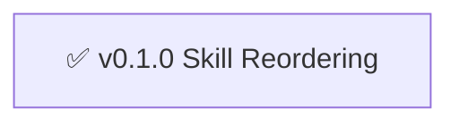

# Skills - Changelog

> 🤖
> | Backstage files | Description |
> | --------------- | ----------- |
> | [README](../README.md) | Our project |
> | [ROADMAP](ROADMAP.md) | What we wanna do |
> | [CHANGELOG](CHANGELOG.md) | What we did |
> | [POLICY](POLICY.md) | How we do it |
> | [HEALTH](HEALTH.md) | What we accept |
>
> We use **[backstage protocol](https://github.com/nonlinear/backstage)**, v0.3.4
> 🤖



## v0.1.0 - 2026-02-14

### Skill Reordering

**Description:** Reorganized skills structure + promoted published skills

**Accomplished:**
- Moved reels-library from life/tasks/ to skills/ (transformed to skill epic)
- Created epic: v2.0.0 - open-with ("abra X" → app mapping)
- Refactored README.md (table format, frontmatter-driven status)
- Updated skills/POLICY.md (README table = frontmatter-driven, auto-discovery, top-aligned)
- Regenerated README table from SKILL.md frontmatters (HTML, valign=top)
- Updated POLICY: companions auto-discovered via ~/Documents/*/skill/
- Updated POLICY: status without emoji (raw frontmatter values)
- Decided: two tables (standalone + companions)
- Moved librarian/ to librarian/skill/ (on epic/v0.15.0-skill-protocol branch), created symlink
- Removed librarian .git (follows parent project)
- Added "Diagram" column to README tables (link to SKILL.md)
- POLICY: Every SKILL.md must have diagram after frontmatter
- Removed backstage-skill/ and librarian/ from skills folder (duplicates, are companions)
- Moved backstage-skill/ to backstage/skill/, created symlink
- OpenClaw system prompt auto-updated via dynamic skill discovery
- Created symlink for librarian skill

**Philosophy:**
"Companion skills pertencem ao projeto que participam"
- Source in project (git, commits, paridade)
- Discovery via symlinks (~/.openclaw/workspace/skills/)
- Versioning follows project ROADMAP
- Only show in main branch (epic branches = WIP, sandboxed)

**Success:**
- Companion skills live in projects, symlinked for discovery
- README auto-generates from frontmatter
- Only stable companions appear (main branch only)
- Clear path: sandbox → test → merge main → appear in README
- Repeatable pattern for future companions

---
    B --> C
    D[📋 v1.4.0 notify]
    C --> D
    E[📋 v1.6.0 system-detective]
    D --> E
    F[📋 v1.7.0 find-books]
    E --> F
    G[📋 v2.0.0 open-with]
    F --> G
    H[📋 v2.1.0 use-for]
    G --> H
```


---

## v1.3.0 - apple-reminders-processing

**Status:** ✅ COMPLETE

**Description:** Smart reminder processing with custom instructions

**What we did:**
- [x] Auto-process reminders without notes (2x/day heartbeat)
- [x] Custom research instructions support (multi-source: books + web + constraints)
- [x] List-based defaults (claw=system solutions, shopping=price comparison, generic=how-to)
- [x] Result tracking with 💎 signifier
- [x] Usage analytics (usage.jsonl + analyze-usage.py)
- [x] Auto-generate shortcuts for top 10 topics

**Published:** https://clawhub.com/skills/reminder-research

**Note:** Skill is HEARTBEAT-integrated, runs automatically. Published as `reminder-research`.

---

_Older completed epics will be moved here from ROADMAP.md_
