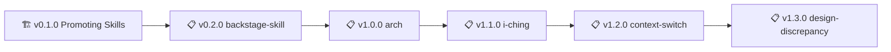

# Skills - Changelog

> 🤖
>
> - [README](../README.md) - Our project
> - [CHANGELOG](CHANGELOG.md) — What we did
> - [ROADMAP](ROADMAP.md) — What we wanna do
> - [POLICY](POLICY.md) — How we do it
> - [HEALTH](HEALTH.md) — What we accept
>
> 🤖

---

_Completed epics will be moved here from ROADMAP.md_

_If you have existing changelog entries, paste them here and run backstage-start to sync format_
