```mermaid
graph LR
    A[🏗️ v0.1.0 Skill Reordering] --> B[📋 v1.0.0 arch]
    B --> C[📋 v1.1.0 i-ching]
    C --> D[📋 v1.4.0 notify]
    D --> E[📋 v1.6.0 system-detective]
    E --> F[📋 v2.0.0 open-with]
```

# Skills - Changelog

> 🤖
>
> - [README](../README.md) - Our project
> - [CHANGELOG](CHANGELOG.md) — What we did
> - [ROADMAP](ROADMAP.md) — What we wanna do
> - [POLICY](POLICY.md) — How we do it
> - [HEALTH](HEALTH.md) — What we accept
>
> 🤖

---

## v1.3.0 - apple-reminders-processing

**Status:** ✅ COMPLETE

**Description:** Smart reminder processing with custom instructions

**What we did:**
- [x] Auto-process reminders without notes (2x/day heartbeat)
- [x] Custom research instructions support (multi-source: books + web + constraints)
- [x] List-based defaults (claw=system solutions, shopping=price comparison, generic=how-to)
- [x] Result tracking with 💎 signifier
- [x] Usage analytics (usage.jsonl + analyze-usage.py)
- [x] Auto-generate shortcuts for top 10 topics

**Published:** https://clawhub.com/skills/reminder-research

**Note:** Skill is HEARTBEAT-integrated, runs automatically. Published as `reminder-research`.

---

_Older completed epics will be moved here from ROADMAP.md_
