# Skills - Changelog

> 🤖
>
> - [README](../README.md) - Our project
> - [CHANGELOG](CHANGELOG.md) — What we did
> - [ROADMAP](ROADMAP.md) — What we wanna do
> - [POLICY](POLICY.md) — How we do it
> - [HEALTH](HEALTH.md) — What we accept
>
> 🤖

```mermaid
graph LR
    A[🏗️ v0.1.0 Promoting Skills] --> B[📋 v0.2.0 backstage-skill]
    B --> C[📋 v1.0.0 arch]
    C --> D[📋 v1.1.0 i-ching]
    D --> E[📋 v1.2.0 context-switch]
    E --> F[📋 v1.3.0 design-discrepancy]
```

---

_Completed epics will be moved here from ROADMAP.md_

_If you have existing changelog entries, paste them here and run backstage-start to sync format_
