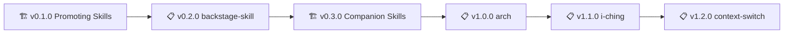

# Skills - Health Metrics

> 🤖
> | Backstage files | Description |
> | --------------- | ----------- |
> | [README](../README.md) | Our project |
> | [ROADMAP](ROADMAP.md) | What we wanna do |
> | [CHANGELOG](CHANGELOG.md) | What we did |
> | [POLICY](POLICY.md) | How we do it |
> | [HEALTH](HEALTH.md) | What we accept |
>
> We use **[backstage protocol](https://github.com/nonlinear/backstage)**
> 🤖

---

> 🌟
>
> This project follows the [global backstage HEALTH](global/HEALTH.md)
> Do write all tests here as explained below
> [/backstage-start](.github/prompts/backstage-start.prompt.md) trigger tests
> For more policies, see [POLICY.md](POLICY.md)
>
> 🌟

---

