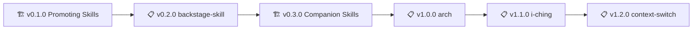

# Project Policy

> 🤖
>
> - [README](../README.md) - Our project
> - [CHANGELOG](CHANGELOG.md) — What we did
> - [ROADMAP](ROADMAP.md) — What we wanna do
> - [POLICY](POLICY.md) — How we do it
> - [HEALTH](HEALTH.md) — What we accept
>
> 🤖

---

> 🌟
>
> This project follows the [global backstage POLICY](global/POLICY.md)
> Do write all policies, standards you want in your project here
> Running [/backstage-start](.github/prompts/backstage-start.prompt.md) enforce them
> If these rules conflict with [global backstage POLICY](global/POLICY.md), yours take precedence
> For more machine tests, see [HEALTH.md](HEALTH.md)
>
> 🌟

---

