```mermaid
graph LR
    A[🏗️ v0.1.0 Skill Reordering]
    B[📋 v1.0.0 arch]
    A --> B
    C[📋 v1.1.0 i-ching]
    B --> C
    D[📋 v1.4.0 notify]
    C --> D
    E[📋 v1.6.0 system-detective]
    D --> E
    F[📋 v1.7.0 find-books]
    E --> F
    G[📋 v2.0.0 open-with]
    F --> G
    H[📋 v2.1.0 use-for]
    G --> H
```

# Project Policy
> 🤖
> | Backstage files | Description |
> | --------------- | ----------- |
> | [README](../README.md) | Our project |
> | [ROADMAP](ROADMAP.md) | What we wanna do |
> | [CHANGELOG](CHANGELOG.md) | What we did |
> | [POLICY](POLICY.md) | How we do it |
> | [HEALTH](HEALTH.md) | What we accept |
>
> We use **[backstage protocol](https://github.com/nonlinear/backstage)**
> 🤖




---

> 🌟
>
> This project follows the [global backstage POLICY](global/POLICY.md)
> Do write all policies, standards you want in your project here
> Running [/backstage-start](.github/prompts/backstage-start.prompt.md) enforce them
> If these rules conflict with [global backstage POLICY](global/POLICY.md), yours take precedence
> For more machine tests, see [HEALTH.md](HEALTH.md)
>
> 🌟

---

## README Tables

**README.md has TWO skill tables, both auto-generated from SKILL.md frontmatter fields.**

**Format:** HTML table with `valign="top"` (top-aligned rows for readability)

**Table 1: What's Here**
- All folders in `~/Documents/skills/` with `SKILL.md`
- Alphabetical order

**Table 2: Companion Skills (belong to other projects)**
- Auto-discovered via `~/Documents/*/skill/` (exclude `~/Documents/skills/`)
- Alphabetical order
- Description appends: `<br>companion for [project](git-repo-link)`

**Table columns:**
- **Name:** `name:` from frontmatter
  - If published: `<br>[published](clawhub-link)`
  - If has diagram: `<br>[flow diagram](path/to/SKILL.md#diagram)`
- **Description:** `description:` from frontmatter
- **Status:** `status:` from frontmatter (no emoji, raw value: `published`, `stable`, `testing`, `draft`)

**Diagram requirement:**
- **Every SKILL.md must have a diagram** after frontmatter (mermaid block)
- **Section heading:** `## Diagram` or `### Diagram` followed by mermaid code block
- **If missing:** Create manually (analyze skill logic: triggers, workflow, description)
- **If exists:** Preserve (never overwrite existing diagrams)
- **Check:** `grep -E "^##+ Diagram" SKILL.md` or look for mermaid block after `---`

**Why:**
- Single source of truth (frontmatter)
- No manual sync drift
- Top-aligned = readable multi-line descriptions
- Companions auto-discovered (no hardcoding)
- Clear separation: this project vs external projects
- Diagrams = visual understanding (design before code)
- Name column = all metadata (published status + diagram link)

---

## Better Skills Frontmatter

**For skills in `better/` folder** (browser/app customization), add `better:` nested block:

```yaml
---
name: skill-name
type: better
version: X.Y.Z
better:
  type: css | service-worker | browser-extension | bookmarklet | userscript
  app:
    name: AppName
    url: https://app-url.com
    version: X.Y.Z  # tested version
  platform: web | ios | android | desktop  # optional, default: web
  browser: chrome | firefox | safari | edge | all  # optional, if web
  reference: technique-doc.md  # link to canonical technique
---
```

**Fields:**
- `better.type` - Customization technique (CSS, Service Worker, etc.)
- `better.app.name` - Target app name
- `better.app.url` - Official app URL
- `better.app.version` - Tested version (compatibility tracking)
- `better.platform` - Target platform (optional, default: `web`)
- `better.browser` - Browser compatibility (optional, if web)
- `better.reference` - Link to technique doc (shared across skills)

**Example:**
```yaml
---
name: openclaw
type: better
version: 0.1.0
better:
  type: css
  app:
    name: OpenClaw
    url: https://openclaw.ai
    version: 2026.2.9
  browser: chrome
  reference: css-customization.md
---
```

**Structure:**
```
skills/better/
├── SKILL.md (master skill - better group)
├── openclaw/
│   └── SKILL.md
├── kavita/
│   └── SKILL.md
└── komga/
    └── SKILL.md
```

**Canonical technique docs** live in better/ repo docs, skills reference them.

---

