# Skills - Roadmap

> 🤖
> This project follows [backstage protocol](https://github.com/nonlinear/backstage) v0.3.4
>
> - [README](../README.md) 👏 [ROADMAP](ROADMAP.md) 👏 [CHANGELOG](CHANGELOG.md) 👏 checks: [local](checks/local/) 3, [global](checks/global/) 28
>
> 🤖

```mermaid
graph LR
    A[✅ v1.0.0 Skill Protocol]
    B[✅ v0.1.0 Skill Reordering]
    C[✅ v0.2.0 Better Apps]
    D[📋 v1.1.0 Roadmap Skill]
    A --> B
    B --> C
    C --> D
    E[📋 v1.2.0 arch]
    D --> E
    F[📋 v1.3.0 i-ching]
    E --> F
    G[📋 v1.4.0 notify]
    F --> G
    H[📋 v1.5.0 system-detective]
    G --> H
    I[📋 v1.6.0 find-books]
    H --> I
    J[📋 v1.7.0 open-with]
    I --> J
    K[📋 v1.8.0 use-for]
    J --> K
    L[📋 v1.9.0 rebranding]
    K --> L
    M[📋 v1.10.0 proton-mail]
    L --> M
    N[📋 v1.11.0 design-discrepancy]
    M --> N
```

## v0.2.0 | [notes](epic-notes/v0.2.0-better-apps.md)

### ✅ Better Apps | [notes](epic-notes/v0.2.0-better-apps.md)

**App customization skills (CSS, Service Worker, per-app toggle)**

**Accomplished:**
- Created better/ namespace (app customizations)
- better-openclaw (CSS dark theme, minimal UI)
- better-kavita (Service Worker offline storage)
- better-komga (Service Worker offline storage)
- Per-app toggle system (standalone skills)
- Frontmatter schema (better: nested block)

**Status:** ✅ Complete (merged to main)

---
>>>>>>> 2f6e8b2 (Add v0.2.0 better-apps epic notes and ROADMAP entry)

## v1.1.0 | [notes](epic-notes/v1.1.0-arch/)

### Roadmap Skill

**Description:** Localhost wrapper (like arch) that loads ROADMAP.md and displays as interactive to-do list organized by epics

**Goal:** Visual epic management with automatic renumbering and task reordering

**Tasks:**
- [ ] Phase 1: Load ROADMAP.md (read-only viewer)
- [ ] Phase 2: Check tasks (mark complete)
- [ ] Phase 3: Add/remove/reorder tasks within epics
- [ ] Phase 4: Reorder epics
- [ ] Phase 5: Automatic renumbering (v0.X.0 → v0.Y.0 on reorder)

**Success:**
- Interactive ROADMAP viewer (localhost)
- Task completion (checkboxes work)
- Drag-and-drop epic reordering
- Auto-renumber on epic move
- Saves back to ROADMAP.md

---

## v1.2.0

### Architecture Design Workflow

**Description:** Architecture design exercises

**Tasks:**
- [ ] https://social.praxis.nyc/@nonlinear/116037514895910044
- [ ] how do we promote it?
- [ ] how you START an exercise? how you CONTINUE? how you do 2 at same time?
- [ ] Add SKILL.md with frontmatter
- [ ] Diary?
- [ ] Test and validate

**Success:**
- Architecture exercises documented
- Clear workflow (start, continue, parallel)
- Integration with librarian (optional)

- [ ] **Approve to merge**

---

## v1.2.0

### i-ching

**Description:** I Ching divination

**Tasks:**
- [ ] different divination ways
  - [ ] dice (2 trigrams)
  - [ ] cards (one hexagram)
  - [ ] coins (6 lines, plus mutable lines)

- [ ] como conectar com OUTRO skill, librarian, mas poder funcionar SEM ele?
- [ ] Document usage examples
- [ ] iching oracle diary?
- [ ] Test and validate

**Success:**
- Multiple divination methods working
- Librarian integration (optional)
- Oracle diary tracking

- [ ] **Approve to merge**

---

## v1.8.0 | [notes](epic-notes/v1.8.0-rebranding-menu.md)

### Rebranding Menu

**Description:** GitHub README SVG menu/banner redesign

**Problem:** Current README navigation needs visual refresh, want custom SVG menu/banner

**Solution:** Design SVG menu following GitHub's sanitization rules

**Tasks:**
- [ ] Research GitHub SVG rules (allowed: static SVG, SMIL animations, inline CSS; blocked: JavaScript, external resources, event handlers)
- [ ] Design menu/banner concept (navigation, branding, interactive elements)
- [ ] Create SVG (inline all resources, base64 images if needed)
- [ ] Test SMIL animations (hover effects, loading states)
- [ ] Validate in GitHub preview (no blocked elements)
- [ ] Document SVG best practices (inline resources, SMIL > CSS, sanitizer rules)
- [ ] Update skills README with new menu

**Details:** [epic-notes/v1.8.0-rebranding-menu.md](epic-notes/v1.8.0-rebranding-menu.md)

**Success Criteria:**
- SVG menu renders correctly on GitHub
- Animations work (SMIL-based)
- No blocked elements (JavaScript, external resources)
- Links functional (<a xlink:href>)
- Documented best practices for future updates

- [ ] **Approve to merge**

---

## v1.3.0

### notify

**Description:** Notifications

**Tasks:**

- [ ] Whats this?

**Success:**
- TBD

- [ ] **Approve to merge**

---

## v1.3.0

### system-detective

**Description:** System diagnostics

**Tasks:**
- [ ] Hmmmm... isso conectar com relay ON, ne?
- [ ] rlay ON keystroke

**Success:**
- Chrome Relay integration
- Keystroke automation

- [ ] **Approve to merge**

---

## v1.5.0

### find-books

**Description:** Book search

**Tasks:**
- [ ] it is librarian, but cant be toooo close since its piracy

**Success:**
- Book search working
- Separate from librarian (piracy concerns)

- [ ] **Approve to merge**

---

## v1.3.0

### open-with

**Description:** "Open in app" as a skill - maps file types/contexts to default apps

**Problem:**
- "Abra X" should open in correct app (Typora, VSCode, Excel, etc.)
- Context matters: README → Typora, .py → VSCode, .xlsx → Excel
- Need extensible mapping (user preferences, project defaults)

**Tasks:**
- [ ] Define open-with mapping (file extensions → apps)
- [ ] Support context overrides (project-specific apps)
- [ ] Handle URLs (browser tabs, specific profiles)
- [ ] Document usage examples
- [ ] Test and validate

**Examples:**
- `open README.md` → Typora
- `open script.py` → VSCode
- `open data.xlsx` → Excel (local app)
- `open https://example.com` → Chrome

**Success:**
- File type mapping working
- Context-aware app selection
- User preferences supported

- [ ] **Approve to merge**

---

## v1.5.0

### use-for

**Description:** Skill suggester (scans all skills, suggests based on context)

**Tasks:**
- [ ] Define skill purpose
- [ ] Add SKILL.md with frontmatter
- [ ] Document usage examples
- [ ] Test and validate

**Success:**
- Context-based skill suggestions
- Auto-discovery working
- User gets right skill for task

- [ ] **Approve to merge**

---

## v1.9.0 | [notes](epic-notes/v1.9.0-proton-mail-finder.md)

### proton-mail-finder

**Description:** Proton Mail search URL builder (direct links to search results)

**Problem:** Proton Mail has powerful search syntax but no CLI/API access

**Solution:** Build URLs with search parameters for quick access (metadata search + content search)

**Tasks:**
- [ ] Research Proton Mail search syntax (from/to, subject, date range, folder, advanced operators)
- [ ] Build URL pattern library (from=X, to=Y, subject=Z, folder=inbox, etc.)
- [ ] Support advanced syntax (OR |, NOT !, phrase "", proximity ~N, wildcards)
- [ ] Check Proton Pass API (is there similar search/URL pattern?)
- [ ] Create SKILL.md with examples
- [ ] Test URL builders (verify links work in Proton Mail web UI)

**Details:** [epic-notes/v1.9.0-proton-mail-finder.md](epic-notes/v1.9.0-proton-mail-finder.md)

**Success Criteria:**
- URL builder creates valid Proton Mail search links
- Advanced syntax supported (OR, NOT, wildcards)
- Proton Pass research complete (API/URL patterns documented)
- Examples documented (common searches)

- [ ] **Approve to merge**

---

## v1.8.0 | [notes](epic-notes/v1.8.0-rebranding-menu.md)

### git-flipbook

**Description:** Git commit timeline → visual report (quarterly retrospectives, ethical drift detection)

**Concept:** 
- Parse git log for timeframe → generate slideshow (Marp/reveal.js)
- Visualize: commits, diffs, milestones, VISION.md alignment
- Suggest new/updated skills based on repeat patterns

**Tasks:**
- [ ] Phase 1: Basic flipbook (commits → markdown → slideshow)
- [ ] Parse git log (--since, --until, --grep for milestones)
- [ ] Generate slideshow format (Marp or reveal.js)
- [ ] Phase 2: VISION.md comparison (ethical drift detection)
- [ ] Flag deviations from VISION.md (manual review)
- [ ] Phase 3: Calendar triggers (moon-aligned quarterly reports)
- [ ] Phase 4: Cross-repo aggregation (multiple projects)
- [ ] Auto-suggest skills based on repeat patterns
- [ ] Test on 2026-Q1, validate format, iterate

**Integration:**
- Extends backstage changelog-as-milestone (quarterly-report.sh)
- Requires: Force commit on core file edits (substrate ready)
- CHANGELOG commits with trailers = milestones

**Success Criteria:**
- Quarterly flipbook generated automatically
- VISION.md drift detected and flagged
- Skills suggested based on patterns
- Timeline visualization clear and useful

---
