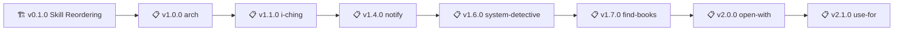

# Skills - Roadmap
> 🤖
> | Backstage files | Description |
> | --------------- | ----------- |
> | [README](../README.md) | Our project |
> | [ROADMAP](ROADMAP.md) | What we wanna do |
> | [CHANGELOG](CHANGELOG.md) | What we did |
> | [POLICY](POLICY.md) | How we do it |
> | [HEALTH](HEALTH.md) | What we accept |
>
> We use **[backstage protocol](https://github.com/nonlinear/backstage)**, v0.3.4
> 🤖

## v0.1.0

### Skill Reordering

**Description:** Reorganize skills structure + promote published skills

**Problem:**
- Companion skills (backstage-skill, librarian) live in skills/ but should live in projects
- Published skills need better visibility and discovery
- README should auto-generate from frontmatter

**Tasks:**

**Companion skills reordering:**
- [x] Move reels-library from life/tasks/ to skills/ (transform to skill epic)
- [x] Create epic: v2.0.0 - open-with ("abra X" → app mapping)
- [x] Refactor README.md (table format, frontmatter-driven status)
- [x] Update skills/POLICY.md (README table = frontmatter-driven, auto-discovery, top-aligned)
- [x] Regenerate README table from SKILL.md frontmatters (HTML, valign=top)
- [x] Update POLICY: companions auto-discovered via ~/Documents/*/skill/
- [x] Update POLICY: status without emoji (raw frontmatter values)
- [x] Decide: two tables (standalone + companions) ✅
- [x] Move librarian/ to librarian/skill/ (on epic/v0.15.0-skill-protocol branch), create symlink ✅
- [x] Remove librarian .git (follows parent project) ✅
- [x] Add "Diagram" column to README tables (link to SKILL.md) ✅
- [x] POLICY: Every SKILL.md must have diagram after frontmatter ✅
- [x] Remove backstage-skill/ and librarian/ from skills folder (duplicates, are companions)
- [x] Move backstage-skill/ to backstage/skill/, create symlink ✅
- [x] Update OpenClaw system prompt (auto-updated via dynamic skill discovery)
- [x] Create symlink for librarian skill (already exists)
- [x] **Approve to merge**

**Philosophy:**
"Companion skills pertencem ao projeto que participam"
- Source in project (git, commits, paridade)
- Discovery via symlinks (~/.openclaw/workspace/skills/)
- Versioning follows project ROADMAP
- **Only show in main branch** (epic branches = WIP, sandboxed)

**Success:**
- Companion skills live in projects, symlinked for discovery
- README auto-generates from frontmatter
- Only stable companions appear (main branch only)
- Clear path: sandbox → test → merge main → appear in README
- Repeatable pattern for future companions

---

## v0.2.0

### Skill Protocol

**Description:** Universal skill formatting rules (frontmatter, diagrams, statuses)

**Tasks:**
- [ ] Create skill-protocol.md (frontmatter/formatting rules for all skills)
- [ ] Update skills/POLICY.md to reference skill-protocol.md
- [ ] Companion skills reference skill-protocol.md (prevent drift)
- [ ] Create companion-skills.md blueprint documentation
- [ ] Document diagram requirements (when mandatory, when optional)
- [ ] Define status values (draft, testing, stable, published)

**Success:**
- Clear protocol documented
- All skills follow same format
- Companions reference protocol (no drift)

- [ ] **Approve to merge**

---

## v1.0.0

### arch

**Description:** Architecture design exercises

**Tasks:**
- [ ] https://social.praxis.nyc/@nonlinear/116037514895910044
- [ ] how do we promote it?
- [ ] how you START an exercise? how you CONTINUE? how you do 2 at same time?
- [ ] Add SKILL.md with frontmatter
- [ ] Diary?
- [ ] Test and validate

**Success:**
- Architecture exercises documented
- Clear workflow (start, continue, parallel)
- Integration with librarian (optional)

- [ ] **Approve to merge**

---

## v1.1.0

### i-ching

**Description:** I Ching divination

**Tasks:**
- [ ] different divination ways
  - [ ] dice (2 trigrams)
  - [ ] cards (one hexagram)
  - [ ] coins (6 lines, plus mutable lines)

- [ ] como conectar com OUTRO skill, librarian, mas poder funcionar SEM ele?
- [ ] Document usage examples
- [ ] iching oracle diary?
- [ ] Test and validate

**Success:**
- Multiple divination methods working
- Librarian integration (optional)
- Oracle diary tracking

- [ ] **Approve to merge**

---

## v1.4.0

### notify

**Description:** Notifications

**Tasks:**

- [ ] Whats this?

**Success:**
- TBD

- [ ] **Approve to merge**

---

## v1.6.0

### system-detective

**Description:** System diagnostics

**Tasks:**
- [ ] Hmmmm... isso conectar com relay ON, ne?
- [ ] rlay ON keystroke

**Success:**
- Chrome Relay integration
- Keystroke automation

- [ ] **Approve to merge**

---

## v1.7.0

### find-books

**Description:** Book search

**Tasks:**
- [ ] it is librarian, but cant be toooo close since its piracy

**Success:**
- Book search working
- Separate from librarian (piracy concerns)

- [ ] **Approve to merge**

---

## v2.0.0

### open-with

**Description:** "Open in app" as a skill - maps file types/contexts to default apps

**Problem:**
- "Abra X" should open in correct app (Typora, VSCode, Excel, etc.)
- Context matters: README → Typora, .py → VSCode, .xlsx → Excel
- Need extensible mapping (user preferences, project defaults)

**Tasks:**
- [ ] Define open-with mapping (file extensions → apps)
- [ ] Support context overrides (project-specific apps)
- [ ] Handle URLs (browser tabs, specific profiles)
- [ ] Document usage examples
- [ ] Test and validate

**Examples:**
- `open README.md` → Typora
- `open script.py` → VSCode
- `open data.xlsx` → Excel (local app)
- `open https://example.com` → Chrome

**Success:**
- File type mapping working
- Context-aware app selection
- User preferences supported

- [ ] **Approve to merge**

---

## v2.1.0

### use-for

**Description:** Skill suggester (scans all skills, suggests based on context)

**Tasks:**
- [ ] Define skill purpose
- [ ] Add SKILL.md with frontmatter
- [ ] Document usage examples
- [ ] Test and validate

**Success:**
- Context-based skill suggestions
- Auto-discovery working
- User gets right skill for task

- [ ] **Approve to merge**

---
