# Skills - Roadmap
> 🤖
> | Backstage files | Description |
> | --------------- | ----------- |
> | [README](../README.md) | Our project |
> | [ROADMAP](ROADMAP.md) | What we wanna do |
> | [CHANGELOG](CHANGELOG.md) | What we did |
> | [POLICY](POLICY.md) | How we do it |
> | [HEALTH](HEALTH.md) | What we accept |
>
> We use **[backstage protocol](https://github.com/nonlinear/backstage)**, v0.3.4
> 🤖

```mermaid
graph LR
    A[🏗️ v0.1.0 Skill Reordering]
    B[📋 v1.0.0 arch]
    A --> B
    C[📋 v1.1.0 i-ching]
    B --> C
    D[📋 v1.4.0 notify]
    C --> D
    E[📋 v1.6.0 system-detective]
    D --> E
    F[📋 v1.7.0 find-books]
    E --> F
    G[📋 v2.0.0 open-with]
    F --> G
    H[📋 v2.1.0 use-for]
    G --> H
```

## v0.1.0

### protocol

**Description:** Universal skill formatting rules (frontmatter, diagrams, statuses)

**Tasks:**
1. [ ] Create skill-protocol.md (frontmatter/formatting rules for all skills)
2. [ ] Update skills/POLICY.md to reference skill-protocol.md
3. [ ] Companion skills reference skill-protocol.md (prevent drift)
4. [ ] Create companion-skills.md blueprint documentation
5. [ ] Document diagram requirements (when mandatory, when optional)
6. [ ] Define status values (draft, testing, stable, published)

**Success:**
- Clear protocol documented
- All skills follow same format
- Companions reference protocol (no drift)

- [ ] **Approve to merge**

---

## v1.0.0

### arch

**Description:** Architecture design exercises

**Tasks:**
- [ ] https://social.praxis.nyc/@nonlinear/116037514895910044
- [ ] how do we promote it?
- [ ] how you START an exercise? how you CONTINUE? how you do 2 at same time?
- [ ] Add SKILL.md with frontmatter
- [ ] Diary?
- [ ] Test and validate

**Success:**
- Architecture exercises documented
- Clear workflow (start, continue, parallel)
- Integration with librarian (optional)

- [ ] **Approve to merge**

---

## v1.1.0

### i-ching

**Description:** I Ching divination

**Tasks:**
- [ ] different divination ways
  - [ ] dice (2 trigrams)
  - [ ] cards (one hexagram)
  - [ ] coins (6 lines, plus mutable lines)

- [ ] como conectar com OUTRO skill, librarian, mas poder funcionar SEM ele?
- [ ] Document usage examples
- [ ] iching oracle diary?
- [ ] Test and validate

**Success:**
- Multiple divination methods working
- Librarian integration (optional)
- Oracle diary tracking

- [ ] **Approve to merge**

---

## v1.4.0

### notify

**Description:** Notifications

**Tasks:**

- [ ] Whats this?

**Success:**
- TBD

- [ ] **Approve to merge**

---

## v1.6.0

### system-detective

**Description:** System diagnostics

**Tasks:**
- [ ] Hmmmm... isso conectar com relay ON, ne?
- [ ] rlay ON keystroke

**Success:**
- Chrome Relay integration
- Keystroke automation

- [ ] **Approve to merge**

---

## v1.7.0

### find-books

**Description:** Book search

**Tasks:**
- [ ] it is librarian, but cant be toooo close since its piracy

**Success:**
- Book search working
- Separate from librarian (piracy concerns)

- [ ] **Approve to merge**

---

## v2.0.0

### open-with

**Description:** "Open in app" as a skill - maps file types/contexts to default apps

**Problem:**
- "Abra X" should open in correct app (Typora, VSCode, Excel, etc.)
- Context matters: README → Typora, .py → VSCode, .xlsx → Excel
- Need extensible mapping (user preferences, project defaults)

**Tasks:**
- [ ] Define open-with mapping (file extensions → apps)
- [ ] Support context overrides (project-specific apps)
- [ ] Handle URLs (browser tabs, specific profiles)
- [ ] Document usage examples
- [ ] Test and validate

**Examples:**
- `open README.md` → Typora
- `open script.py` → VSCode
- `open data.xlsx` → Excel (local app)
- `open https://example.com` → Chrome

**Success:**
- File type mapping working
- Context-aware app selection
- User preferences supported

- [ ] **Approve to merge**

---

## v2.1.0

### use-for

**Description:** Skill suggester (scans all skills, suggests based on context)

**Tasks:**
- [ ] Define skill purpose
- [ ] Add SKILL.md with frontmatter
- [ ] Document usage examples
- [ ] Test and validate

**Success:**
- Context-based skill suggestions
- Auto-discovery working
- User gets right skill for task

- [ ] **Approve to merge**

---
