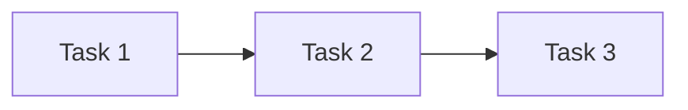

# v1.1.0 - Architecture Design Workflow

**Status:** 🏗️ IN PROGRESS  
**Created:** 2026-02-15  
**Dual Track:** Works with librarian v0.15.0 (feedback loop)

---

## Goal

Build **localhost wrapper engine** for mermaid diagrams with external CSS.

**Metaphor:** Tape machine architecture
- **Engine** = HTML loader (machine that plays tapes)
- **Tape** = MD files with mermaid diagrams (data)
- **First tape:** `librarian/backstage/epic-notes/v0.15.0-skill-protocol.md`

---

## Architecture

### Multi-Device Presentation Layer

**Engine = Presentation** (not just local viewer)

**Future scenario (Tailscale network):**
- **iPhone:** Conversation with Kin (voice/text)
- **iPad:** Visualize diagrams (engine rendering)
- **MacBook:** Edit MDs (Typora)
- **All devices:** See same state (paridade visual)

**Flow:**
```
Nicholas speaks (iPhone)
  ↓
Kin updates MD (librarian epic-notes)
  ↓
Engine detects change (hot reload)
  ↓
All devices see update (iPad, MacBook, etc.)
  ↓
Visual parity = shared understanding
```

**Deployment targets:**
- **Now:** localhost:8080 (development)
- **Soon:** NAS via Tailscale (multi-device access)
- **Future:** Mac Studio (permanent server, March 2026)

### Engine Location

**Path:** `~/Documents/skills/arch/engine/`

**Why inside skill:**
- Skills can spawn localhost servers
- Arch skill = reusable across projects
- Engine = infrastructure (not project-specific)

### Components

1. **index.html** - Wrapper HTML (loads MD, renders mermaid)
2. **styles.css** - CSS variables + classDef system (colors, states)
3. **serve.sh** - Localhost launcher script
4. **README.md** - How to use engine (add new tapes)

### Data Flow

```
User opens: http://localhost:8080?md=/path/to/file.md
  ↓
index.html fetches MD file
  ↓
Parse mermaid blocks (```mermaid ... ```)
  ↓
Render with mermaid.js + apply external CSS
  ↓
Display diagram in browser
```

---

## Design Principles

### 1. Paridade Visual (CSS as Phases)

**Goal:** All devices see the SAME diagram state.

**How:** 
- CSS colors = diagram states (approved, blocker, pending, in-progress)
- Hot reload = continuous sync (2s polling)
- Multi-device access = Tailscale network

**Why paridade matters:**
- **Shared map:** No ambiguity about current state
- **Visual sync:** Colors communicate status instantly across ALL devices
- **Multi-device presentation:** iPhone (talk) + iPad (see) + MacBook (edit)
- **Planning exhaustion:** Diagram shows ALL states, ALL transitions
- **Autonomous work:** Once ambiguities removed, Kin works alone

**Philosophy:** "lembra que eh um engine de APRESENTACAO. ate pq precisamos acessar por outros devices… no futuro posso ter 3 devices conectado contigo via tailscale… conversamos via iphone, mas visualizo mudancas no ipad. conversa muda md, o engine catch e mostra. e todos devices conectados tem acesso."

**Hot reload = CRITICAL:** Not optional feature, core presentation requirement.

### 2. CSS Variables External (Not Inline)

**Problem:** Mermaid doesn't support CSS variables inside diagrams.

**Solution:** Define variables OUTSIDE diagram, apply via stylesheet.

**Example:**
```css
:root {
  --approved-border: #00AA00;
  --blocker-bg: #FF0000;
  --pending-bg: #FFD700;
}

.mermaid .approved {
  stroke: var(--approved-border);
  stroke-width: 3px;
}
```

**Why:** Single color palette, reusable across all diagrams.

### 2. Diagrams Stay Clean (No Styling)

**Mermaid code stays vanilla:**


**CSS applies classes automatically** via selectors (no manual classDef in diagram).

### 3. Engine = Reusable (Not Project-Specific)

**Any project can use engine:**
- Point to different MD files (tapes)
- Same CSS system (consistent colors)
- Same localhost workflow

---

## First Tape

**File:** `~/Documents/librarian/backstage/epic-notes/v0.15.0-skill-protocol.md`

**Contains:** Mermaid diagram with CSS variable issues (needs wrapping)

**Goal:** Render this diagram with external CSS (proof of concept)

---

## Success Criteria

- [ ] Engine renders librarian v0.15.0 diagram
- [ ] CSS variables work (colors applied from external stylesheet)
- [ ] Localhost server runs from skill (serve.sh)
- [ ] Documentation clear (how to add new tapes)
- [ ] Dual track validated (librarian uses engine, discovers issues, skills fixes)

---

## Session Log

### 2026-02-15 14:59 EST - Epic Start

**Nicholas directive:** "crie o engine do html load, DENTRO do skill. skills podem spun localhost, certo? dai eh tipo tapes, o engine eh a maquina que roda os tapes. o md eh o TAPE."

**First tape identified:** `v0.15.0-skill-protocol.md` (librarian)

**Next:** Build engine components (index.html, styles.css, serve.sh)
