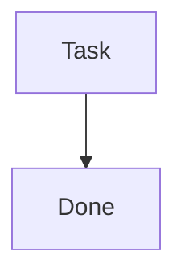

# Epic v1.1.0 - Contract Diagram

**Collaborative contract diagram design via mermaid with AI.**

---

## Design Principles

### Tape Machine Architecture

**Engine = HTML wrapper** (plays tapes)  
**Tape = MD files** with mermaid diagrams (data)

The engine loads any markdown file and renders its mermaid diagrams with a unified CSS system.

**Why this works:**
- Clean separation: engine (presentation) vs tape (content)
- Reusable: any project can use same engine
- Portable: MD files work anywhere (GitHub, local, web)

---

### Single Source of Truth (CSS)

**Problem:** Inline mermaid styles = scattered config, hard to maintain.

**Solution:** External CSS variables + selectors.

Define colors ONCE in `styles.css`:

```css
:root {
    --approved-bg: #FFF9C4;
    --developed-bg: #D5F5D5;
    --blocker-bg: #FFCDD2;
}
```

Applied via selectors:

```css
.mermaid .node.approved rect {
    fill: var(--approved-bg) !important;
}
```

**Benefit:** Change theme in ONE place, all diagrams update.

---

### Clean Diagrams

Mermaid code stays vanilla (no inline styles):



**Why:** Diagrams readable in GitHub, no style noise.

---

### Claiming Protocol

**Auto-injection on first load:**

1. Check if diagram has title (regex: `/##.*contract diagram/`)
2. If missing → CLAIM:
   - Detect phase from node classes
   - Inject title + badge + CSS init
   - Write back to MD file
3. Periodic update (5s): Re-detect phase, update badge if changed

**Benefit:** Zero manual setup, diagrams self-configure.

---

## Implementation Notes

### Phase Detection Logic

Count nodes by class (ignoring `outside-system`):

- **Design phase:** Has `default` or `blocker` nodes
- **Ready to approve:** All nodes `approved` (yellow)
- **Development phase:** Has `developed` nodes (green)

### Outside-System Nodes

**User actions** (PUBLISH, TESTS) marked with dashed borders:

```css
.outside-system rect {
    stroke-dasharray: 5 5 !important;
}
```

**Not counted in phase detection** (wrapper doesn't control them).

---

## Lessons Learned

1. **Meta-design works:** Used contract diagram to build contract diagram skill
2. **Unsupervised development effective:** Autonomous implementation of 5+ nodes
3. **Cleanup matters:** Deleted 750+ lines of obsolete code before publish
4. **Git safety critical:** Commit before every edit prevented data loss

---

**Duration:** ~6 hours (afternoon + evening)  
**Commits:** 40+ commits  
**Lines changed:** -800 deletions, +500 additions  
**Status:** Ready for clawhub publication (pending periodic badge update fix)

---

## Deleted Sections from SKILL.md (Archived for Future Reference)

**Removed 2026-02-22 (commit afacb8f):** Philosophy and enforcement protocols moved here for future skill versions.

  ./serve.sh &
  open "http://localhost:8080/?md=../../[PROJECT]/epic-notes/webhook-contract.md"
```

**Hot reload enabled by default** (2s interval).

---

## Research/Validation Phase (Phase 3.5)

**BEFORE turning everything yellow (approval):**

1. **AI identifies validation needs:**
   - Which decisions need validation?
   - What sources to consult? (books, docs, best practices)
   - What questions to ask?

2. **Research phase:**
   - Query relevant knowledge bases (librarian for books, web search, documentation)
   - Test assumptions against established patterns
   - Discover edge cases we missed

3. **Discovery cycle:**
   - Research findings may reveal NEW red notes (back to Phase 3)
   - Add new numbered notes (4️⃣, 5️⃣, etc.) for issues discovered
   - Discuss new findings
   - Iterate until validated

**Rule:** Can't approve (yellow) until BOTH:
- All discussions resolved (red → yellow)
- All validations complete (tested against knowledge)

---

## Contract Stability = Communication Efficiency

**Contracts are PUBLIC APIs:**
- Shared reference point (everyone looks at same thing)
- Muscle memory (always in same place)
- Single source of truth (no ambiguity)
- **Breaking contracts = breaking trust at scale**

**Rules (NON-NEGOTIABLE):**

1. **One file per epic** (never create new md for same epic)
2. **One diagram** (edit existing, never duplicate)
3. **Diagram always at top** (position never changes)
4. **Edit in place** (add nodes, change colors, update text)

**If you change file, diagram, or position → NOISE. Lack of parity.**

---

## Visual Diff = Async Collaboration

**Diagram colors = changelog. No reading required.**

**User wakes up, opens Typora:**
- ⚫ Gray → 🔵 Blue = "AI implemented this"
- 🟨 Yellow → 🔴 Red = "AI tried, broke"
- New numbered notes (3️⃣ 4️⃣) = "AI found problems"

**User INSTANTLY knows:**
- ✅ What was done (blue nodes)
- ✅ What broke (red nodes)
- ✅ What needs discussion (numbered notes)

**WITHOUT reading a single word.**

---

## Enforcement Protocol

**When I detect "contract: [topic]" trigger:**

1. **🔍 Check existing documents:**
   ```bash
   find epic-notes/ -name "*[topic]*architecture*.md"
   ```

2. **📋 Decision tree:**
   - **If document exists for this epic** → UPDATE SAME document
   - **If no document exists** → CREATE NEW document
   - **If ambiguous** → ASK USER before creating

3. **🚨 NEVER silently create new document** when existing one applies

4. **✅ Document continuation in commit:**
   ```bash
   git commit -m "contract: [topic] - [gray/yellow/blue] phase (updated existing)"
   ```

---

## Integration with Backstage

**Add to ROADMAP:**
```markdown
- [ ] **Exercise:** Design [system] contract (epic-notes/[name]-contract.md)
```

**Workflow:**
1. User triggers contract-diagram skill
2. Iterate until all yellow (approved)
3. Mark ROADMAP task done
4. AI executes (yellow → blue)
5. Reference in commits: `git commit -m "feat: webhook (see epic-notes/webhook-contract.md)"`

---

**This protocol = CRITICAL. Don't lose this knowledge.** 🔒
