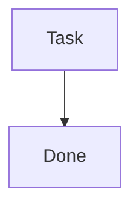

# Epic v1.1.0 - Contract Diagram

**Collaborative contract diagram design via mermaid with AI.**

---

## Design Principles

### Tape Machine Architecture

**Engine = HTML wrapper** (plays tapes)  
**Tape = MD files** with mermaid diagrams (data)

The engine loads any markdown file and renders its mermaid diagrams with a unified CSS system.

**Why this works:**
- Clean separation: engine (presentation) vs tape (content)
- Reusable: any project can use same engine
- Portable: MD files work anywhere (GitHub, local, web)

---

### Single Source of Truth (CSS)

**Problem:** Inline mermaid styles = scattered config, hard to maintain.

**Solution:** External CSS variables + selectors.

Define colors ONCE in `styles.css`:

```css
:root {
    --approved-bg: #FFF9C4;
    --developed-bg: #D5F5D5;
    --blocker-bg: #FFCDD2;
}
```

Applied via selectors:

```css
.mermaid .node.approved rect {
    fill: var(--approved-bg) !important;
}
```

**Benefit:** Change theme in ONE place, all diagrams update.

---

### Clean Diagrams

Mermaid code stays vanilla (no inline styles):



**Why:** Diagrams readable in GitHub, no style noise.

---

### Claiming Protocol

**Auto-injection on first load:**

1. Check if diagram has title (regex: `/##.*contract diagram/`)
2. If missing → CLAIM:
   - Detect phase from node classes
   - Inject title + badge + CSS init
   - Write back to MD file
3. Periodic update (5s): Re-detect phase, update badge if changed

**Benefit:** Zero manual setup, diagrams self-configure.

---

## Implementation Notes

### Phase Detection Logic

Count nodes by class (ignoring `outside-system`):

- **Design phase:** Has `default` or `blocker` nodes
- **Ready to approve:** All nodes `approved` (yellow)
- **Development phase:** Has `developed` nodes (green)

### Outside-System Nodes

**User actions** (PUBLISH, TESTS) marked with dashed borders:

```css
.outside-system rect {
    stroke-dasharray: 5 5 !important;
}
```

**Not counted in phase detection** (wrapper doesn't control them).

---

## Lessons Learned

1. **Meta-design works:** Used contract diagram to build contract diagram skill
2. **Unsupervised development effective:** Autonomous implementation of 5+ nodes
3. **Cleanup matters:** Deleted 750+ lines of obsolete code before publish
4. **Git safety critical:** Commit before every edit prevented data loss

---

**Duration:** ~6 hours (afternoon + evening)  
**Commits:** 40+ commits  
**Lines changed:** -800 deletions, +500 additions  
**Status:** Ready for clawhub publication (pending periodic badge update fix)
