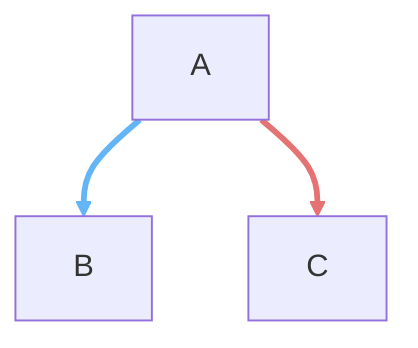

# Architecture Diagram Color Legend

**Global reference for all architecture diagrams.**

**Version:** 1.0  
**Last Updated:** 2026-02-12

---

## Color Palette

<table>
  <tr>
    <th></th>
    <th>Node</th>
    <th>Arrow</th>
    <th>Name</th>
    <th>Use this color when...</th>
  </tr>
  <tr>
    <td style="font-weight: bold; font-size: 18px;">1</td>
    <td style="background-color: #CECECE; color: black; text-align: center; width: 60px;"></td>
    <td style="background-color: #9E9E9E; color: white; text-align: center; width: 60px;"></td>
    <td>Neutral</td>
    <td>No agreement yet. Backlog, not discussed, not approved.</td>
  </tr>
  <tr>
    <td style="font-weight: bold; font-size: 18px;">2</td>
    <td style="background-color: #FFE083; color: black; text-align: center; width: 60px;"></td>
    <td style="background-color: #FFB74D; color: black; text-align: center; width: 60px;"></td>
    <td>Approved</td>
    <td>Agreed by all stakeholders, ready for development. Sometimes has notes.</td>
  </tr>
  <tr>
    <td style="font-weight: bold; font-size: 18px;">3</td>
    <td style="background-color: #FAB3AE; color: black; text-align: center; width: 60px;"></td>
    <td style="background-color: #E57373; color: white; text-align: center; width: 60px;"></td>
    <td>Blocker</td>
    <td>Either needs discussion to agree, OR failed implementation. <strong>Always with numbered note.</strong></td>
  </tr>
  <tr>
    <td style="font-weight: bold; font-size: 18px;">4</td>
    <td style="background-color: #90CAF9; color: black; text-align: center; width: 60px;"></td>
    <td style="background-color: #64B5F6; color: white; text-align: center; width: 60px;"></td>
    <td>Developed</td>
    <td>Agreed and implemented. Ready for testing.</td>
  </tr>
  <tr>
    <td style="font-weight: bold; font-size: 18px;">5</td>
    <td style="background-color: #FFCB7F; color: black; text-align: center; width: 60px;"></td>
    <td style="background-color: #FF9800; color: white; text-align: center; width: 60px;"></td>
    <td>Developed*</td>
    <td>Agreed and implemented, but developer (AI) made decisions that warrant discussion.</td>
  </tr>
  <tr>
    <td style="font-weight: bold; font-size: 18px;">6</td>
    <td style="background-color: #D7A8DF; color: black; text-align: center; width: 60px;"></td>
    <td style="background-color: #BA68C8; color: white; text-align: center; width: 60px;"></td>
    <td>Partial</td>
    <td>Node works, but some paths (arrows) fail. <strong>Use arrow colors to show which paths work vs fail.</strong></td>
  </tr>
</table>

---

## Mermaid Syntax

**Node colors:**
```mermaid
style NODE_NAME fill:#90CAF9,stroke:#64B5F6,color:#000
```

**Arrow colors (linkStyle):**


**Arrow colors (inline, Mermaid v10+):**
```mermaid
A -->|"✅ Happy path"| B
A -.->|"❌ Error path"| C
```

---

## Hex Code Reference

| # | Name | Node (fill) | Arrow (stroke) |
|---|------|-------------|----------------|
| 1 | Neutral | `#CECECE` | `#9E9E9E` |
| 2 | Approved | `#FFE083` | `#FFB74D` |
| 3 | Blocker | `#FAB3AE` | `#E57373` |
| 4 | Developed | `#90CAF9` | `#64B5F6` |
| 5 | Developed* | `#FFCB7F` | `#FF9800` |
| 6 | Partial | `#D7A8DF` | `#BA68C8` |

---

## Usage Guidelines

**Node colors = component status:**
- Gray (1): Not discussed
- Yellow (2): Approved, ready for dev
- Pink (3): Blocked (always add numbered note)
- Blue (4): Implemented, ready for testing
- Orange (5): Implemented but has discussion points
- Purple (6): Node works but some paths fail

**Arrow colors = path status:**
- Use darker version of node color
- Partial nodes (6): color arrows to show which paths work (blue/green) vs fail (red)
- Example: Node purple + blue arrow (works) + red arrow (broken)

**Numbered notes:**
- Always use with Blocker (3)
- Always use with Partial (6) to document which paths fail
- Optional for others

---

## Version History

- **v1.0** (2026-02-12): Initial global legend with node + arrow colors

---

**GitHub:** *(Add link when published)*  
**Issues:** Report color conflicts or missing states
