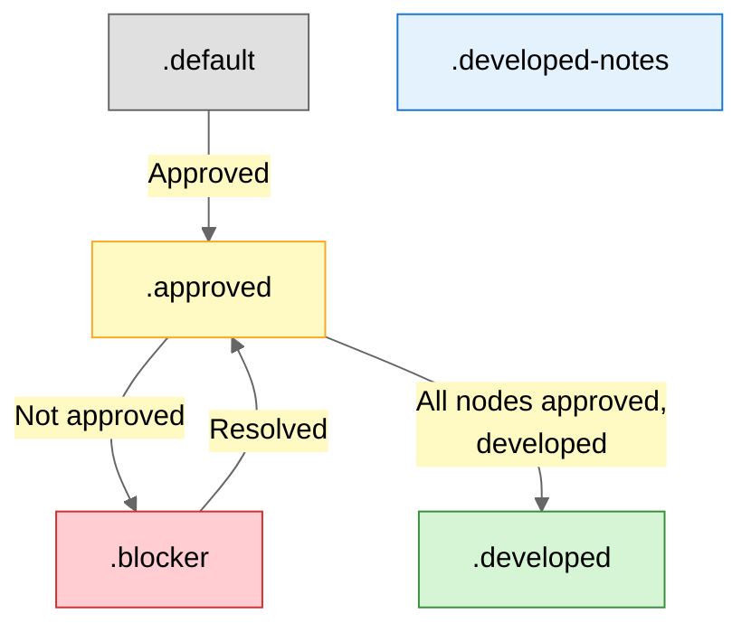

# Contract Diagram Skill

**Contract diagram aims to enforce a legible document between AIs and humans**

****

- **1️⃣ Gray (.default):** Draft/backlog, not discussed yet
- **2️⃣ Yellow (.approved):** Agreed by stakeholders, ready for development
- **3️⃣ Red (.blocker):** Needs discussion OR failed implementation (always has numbered note)
- **4️⃣ Blue (.developed):** Agreed and implemented, ready for testing
- **5️⃣ Orange (.developed-notes):** Implemented but developer made decisions needing discussion

---

## Requirements

**Wrapper can claim (edit) contracts:**
- Contract MDs must be in engine's domain (`engine/` folder or symlinked)
- Node.js server enables read/write via `/write` endpoint

---

## Policies

In order for this exercise to work, you need:

1. to commit before any change
2. enforce parity between system and diagram (no system without diagram. no diagram with wrong system representation)
3. sandbox epics on branches, so you only "release" systems after approved, developed, tested

---

## Use Cases

- System architecture (flows, components, data)
- API design (endpoints, schemas, auth)
- Database models (ERD, relationships)
- Workflows (state machines, processes)
- Infrastructure (deployment, networking)
