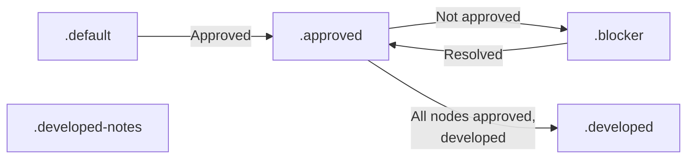

# Contract Diagram Skill

**Collaborative architecture design via mermaid diagrams with AI.**

---

## Legend (Color Protocol)



**Color meanings:**
- **Gray (.default):** Draft/backlog, not discussed yet
- **Yellow (.approved):** Agreed by stakeholders, ready for development
- **Red (.blocker):** Needs discussion OR failed implementation (always has numbered note)
- **Blue (.developed):** Agreed and implemented, ready for testing
- **Orange (.developed-notes):** Implemented but developer made decisions needing discussion

---

## Quick Start

```bash
# Start new contract diagram
contract-diagram start my-system

# AI will help you iterate on the diagram
# When done, it's saved in epic-notes/

# List saved contracts
contract-diagram list

# Re-open to edit
contract-diagram open my-system
```

---

## What We Learned (From Backstage)

**Design principles extracted from v0.3.0 architecture work:**

1. **Legend always** (colors, arrows, shapes)
2. **Annotations > comments** (explain why, not just what)
3. **Start simple, iterate** (don't design everything upfront)
4. **Decision points = diamonds** (make control flow explicit)
5. **Colors = layers** (consistent coloring = easier reading)
6. **One diagram = one concern** (separate deployment, data, API)
7. **Save iterations** (v1, v2, v3 = learning history)

---

## Use Cases

- System architecture (flows, components, data)
- API design (endpoints, schemas, auth)
- Database models (ERD, relationships)
- Workflows (state machines, processes)
- Infrastructure (deployment, networking)

---

## Integration with Backstage

Add to ROADMAP:
```markdown
- [ ] **Exercise:** Design [system] contract diagram (mermaid diagram)
```

Iterate with AI → save to `epic-notes/[name]-architecture.md` → mark done

---

## Files

- `SKILL.md` - Full documentation + templates
- `contract-diagram.sh` - CLI tool
- `README.md` - This file

---

**Version:** 0.1.0  
**Status:** Experimental (generalizing backstage learnings)
