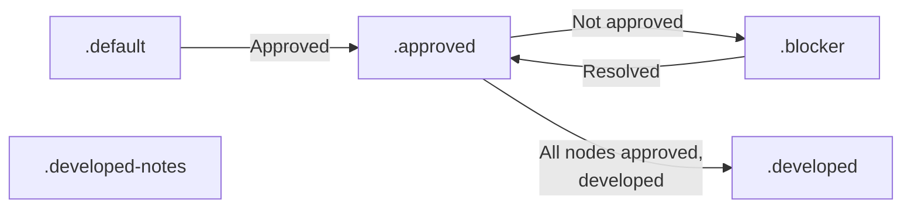

# Contract Diagram Skill

**Collaborative architecture design via mermaid diagrams with AI.**

---

## Legend (Color Protocol)

**Color meanings:**
- **Gray (.default):** Draft/backlog, not discussed yet
- **Yellow (.approved):** Agreed by stakeholders, ready for development
- **Red (.blocker):** Needs discussion OR failed implementation (always has numbered note)
- **Blue (.developed):** Agreed and implemented, ready for testing
- **Orange (.developed-notes):** Implemented but developer made decisions needing discussion

---

## Goals

Contract diagram aims to enforce a document, legible by both AIs and humans. 

---

## Policies

In order for this exercise to work, you need:

1. to commit before any change
2. enforce parity between system and diagram (no system without diagram. no diagram with wrong system representation)
3. sandbox epics on branches, so you only "release" systems after approved, developed, tested

---

## Use Cases

- System architecture (flows, components, data)
- API design (endpoints, schemas, auth)
- Database models (ERD, relationships)
- Workflows (state machines, processes)
- Infrastructure (deployment, networking)
