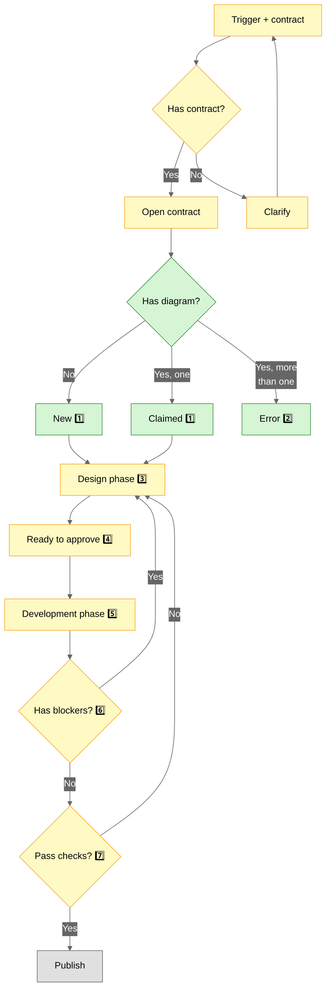

<span style="background-color:#e0e0e0; border:2px solid #666; padding:5px 10px; border-radius:5px; color:#000;">default</span> Draft/backlog, not discussed yet

<span style="background-color:#FFF9C4; border:2px solid #F9A825; padding:5px 10px; border-radius:5px; color:#000;">approved</span> Agreed by stakeholders, ready for development

<span style="background-color:#FFCDD2; border:2px solid #D32F2F; padding:5px 10px; border-radius:5px; color:#000;">blocker</span> Needs discussion OR failed implementation (always has numbered note)

<span style="background-color:#D5F5D5; border:2px solid #388E3C; padding:5px 10px; border-radius:5px; color:#000;">developed</span> Agreed and implemented, ready for testing

<span style="background-color:#E3F2FD; border:2px solid #1976D2; padding:5px 10px; border-radius:5px; color:#000;">developed-notes</span> Implemented but developer made decisions needing discussion

---

## contract-skill contract diagram [ℹ️](https://github.com/nonlinear/skills/tree/main/contract-diagram/SKILL.md) 

## contract-skill contract diagram [ℹ️](https://github.com/nonlinear/skills/tree/main/contract-diagram/SKILL.md) 



**1️⃣** Claiming: Wrapper detects phase (from node classes), injects title + phase badge + CSS on first load

**2️⃣** One diagram rule: Multiple diagrams break muscle memory. Create separate files if needed.

**3️⃣** Design phase: Stakeholders (AI + humans) iterate on flow, discuss blockers, approve nodes. Default or blocker nodes = still designing.

**4️⃣** Ready to approve: All nodes approved (blue). AI checks permissions/auth, asks user to start development.

**5️⃣** Development phase: AI builds, updates nodes to developed (green), developed-notes (yellow), or blocker (red).

**6️⃣** Has blockers?: Check if development hit blockers. Yes → back to Design phase. No → proceed to checks.

**7️⃣** Pass checks?: Validate implementation (external tests). Yes = publish. No = back to Design phase for fixes.

---

- contract: .md file
- diagram: mermaid


## Numbered Notes (1️⃣ 2️⃣ 3️⃣)

**When to use:**

**Pre-execution (design phase):**
- Questions that need discussion
- Trade-offs that need decisions
- Unclear requirements

**During execution:**
- Errors AI can't resolve alone
- Permission needed (destructive action, cost implications)
- Ambiguity in implementation

**Format:**

```markdown
### 1️⃣ [Component Name] - [Issue Title]
**Question/Error:** ...
**Context:** ...
**Options:** A, B, C
**Needed:** Decision / Permission / Help
```

**Notes without numbers = just explanations, turn yellow when approved.**

---

## Localhost Trigger

**Trigger:** "lets diagram [PATH]"

**Assumes:** File at PATH already has mermaid diagram.

**Action:**
1. Start localhost server (port 8080)
2. Open browser: `http://localhost:8080/?md=[PATH]`
3. Diagram renders with color protocol

**Example:**
```
User: "lets diagram epic-notes/webhook-contract.md"
AI: 
  cd ~/Documents/skills/contract-diagram/engine
  ./serve.sh &
  open "http://localhost:8080/?md=../../[PROJECT]/epic-notes/webhook-contract.md"
```

**Hot reload enabled by default** (2s interval).

---

## Research/Validation Phase (Phase 3.5)

**BEFORE turning everything yellow (approval):**

1. **AI identifies validation needs:**
   - Which decisions need validation?
   - What sources to consult? (books, docs, best practices)
   - What questions to ask?

2. **Research phase:**
   - Query relevant knowledge bases (librarian for books, web search, documentation)
   - Test assumptions against established patterns
   - Discover edge cases we missed

3. **Discovery cycle:**
   - Research findings may reveal NEW red notes (back to Phase 3)
   - Add new numbered notes (4️⃣, 5️⃣, etc.) for issues discovered
   - Discuss new findings
   - Iterate until validated

**Rule:** Can't approve (yellow) until BOTH:
- All discussions resolved (red → yellow)
- All validations complete (tested against knowledge)

---

## Contract Stability = Communication Efficiency

**Contracts are PUBLIC APIs:**
- Shared reference point (everyone looks at same thing)
- Muscle memory (always in same place)
- Single source of truth (no ambiguity)
- **Breaking contracts = breaking trust at scale**

**Rules (NON-NEGOTIABLE):**

1. **One file per epic** (never create new md for same epic)
2. **One diagram** (edit existing, never duplicate)
3. **Diagram always at top** (position never changes)
4. **Edit in place** (add nodes, change colors, update text)

**If you change file, diagram, or position → NOISE. Lack of parity.**

---

## Visual Diff = Async Collaboration

**Diagram colors = changelog. No reading required.**

**User wakes up, opens Typora:**
- ⚫ Gray → 🔵 Blue = "AI implemented this"
- 🟨 Yellow → 🔴 Red = "AI tried, broke"
- New numbered notes (3️⃣ 4️⃣) = "AI found problems"

**User INSTANTLY knows:**
- ✅ What was done (blue nodes)
- ✅ What broke (red nodes)
- ✅ What needs discussion (numbered notes)

**WITHOUT reading a single word.**

---

## Enforcement Protocol

**When I detect "contract: [topic]" trigger:**

1. **🔍 Check existing documents:**
   ```bash
   find epic-notes/ -name "*[topic]*architecture*.md"
   ```

2. **📋 Decision tree:**
   - **If document exists for this epic** → UPDATE SAME document
   - **If no document exists** → CREATE NEW document
   - **If ambiguous** → ASK USER before creating

3. **🚨 NEVER silently create new document** when existing one applies

4. **✅ Document continuation in commit:**
   ```bash
   git commit -m "contract: [topic] - [gray/yellow/blue] phase (updated existing)"
   ```

---

## Integration with Backstage

**Add to ROADMAP:**
```markdown
- [ ] **Exercise:** Design [system] contract (epic-notes/[name]-contract.md)
```

**Workflow:**
1. User triggers contract-diagram skill
2. Iterate until all yellow (approved)
3. Mark ROADMAP task done
4. AI executes (yellow → blue)
5. Reference in commits: `git commit -m "feat: webhook (see epic-notes/webhook-contract.md)"`

---

**This protocol = CRITICAL. Don't lose this knowledge.** 🔒
