# Contract Diagram Skill

**Collaborative contract diagram design via mermaid diagrams with AI.**

**Alias:** `contract` (contract = agreement before implementation)

```mermaid
flowchart LR
    TRIGGER["🎤 User Trigger<br/>'design X'"]
    CREATE["👷 Create MD<br/>epic-notes/"]
    DRAFT["⚫ Gray Flow<br/>Structure only"]
    NOTES["🔴 Red Notes<br/>Discussions"]
    RESEARCH["📚 Validate<br/>Books/Docs"]
    APPROVE["🟨 Yellow<br/>All approved"]
    EXECUTE["🔵 Blue<br/>Implementation"]
    ERROR["🔴 Red Again<br/>Roadblocks"]
    
    TRIGGER --> CREATE
    CREATE --> DRAFT
    DRAFT --> NOTES
    NOTES --> RESEARCH
    RESEARCH -->|New issues| NOTES
    RESEARCH -->|Validated| APPROVE
    APPROVE --> EXECUTE
    EXECUTE -->|Success| EXECUTE
    EXECUTE -->|Blocked| ERROR
    ERROR --> NOTES
    
    style TRIGGER fill:#E8EAF6,stroke:#5C6BC0,color:#000
    style CREATE fill:#FFF9C4,stroke:#F9A825,color:#000
    style DRAFT fill:#CECECE,stroke:#9E9E9E,color:#000
    style NOTES fill:#FAB3AE,stroke:#E57373,color:#000
    style RESEARCH fill:#C5E1A5,stroke:#7CB342,color:#000
    style APPROVE fill:#FFE083,stroke:#FFB74D,color:#000
    style EXECUTE fill:#90CAF9,stroke:#64B5F6,color:#000
    style ERROR fill:#FAB3AE,stroke:#E57373,color:#000
```

---

## What It Does

Design and validate architecture **before coding** through iterative diagram refinement with AI.

**Use for:**
- System architecture (flows, components, data)
- API design (endpoints, schemas, auth)
- Database models (ERD, relationships)
- Workflows (state machines, processes)
- Infrastructure (deployment, networking)

---

## Trigger

**English:**
- "design architecture for X"
- "let's architect X"
- "we need a user journey for Y"
- "we need a flow for Z"
- "let's do a flow for X"
- "we need a XYZ architecture plan"
- "draft the architecture for Y"
- "let's diagram this out"
- "before coding, let's map this"
- "how would the flow work?"

**Portuguese:**
- "vamos desenhar a arquitetura de X"
- "preciso de um diagrama de Y"
- "antes de codar, vamos mapear isso"
- "como seria o flow de X?"
- "vamos arquitetar Y"
- "precisamos de um user journey pra Z"
- "precisamos de um fluxo pra X"
- "precisamos de um plano de arquitetura XYZ"

**Natural language, not slash commands.**

---

## The Complete Flow (CRITICAL - Read This!)

### Phase 1: Gray Flow (Structure)

**Start with ALL GRAY components**

1. AI creates `epic-notes/[system-name]-architecture.md`
2. Open in Typora (both see it)
3. Build flow structure together (back and forth)
4. Everything GRAY at this stage

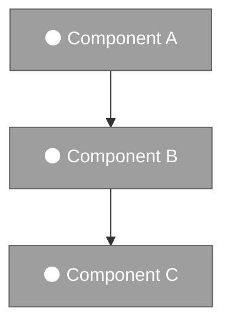

**Purpose:** Agree on FLOW structure first, details later

---

### Phase 2: Add Notes (Gray → Red or Yellow)

**When we agree on flow structure:**

**Add notes to components:**
- If **needs discussion** → Red with numbered note (1️⃣, 2️⃣, etc.)
- If **just explanation** → stays gray, will turn yellow when approved

**Red note example:**

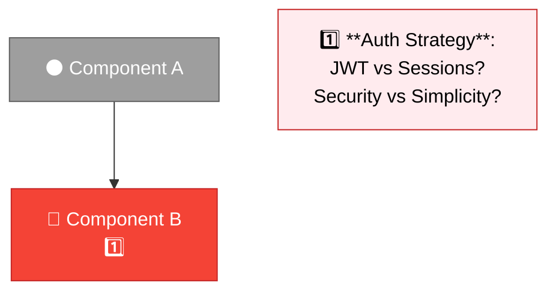

**In markdown:**
```markdown
## Notes

### 1️⃣ Component B - Auth Strategy
**Question:** JWT or Sessions?
- JWT: Stateless, scalable, more complex
- Sessions: Simpler, needs server state

**Need decision before proceeding.**
```

---

### Phase 3: Discuss Red Notes

**For each red note (1️⃣, 2️⃣, etc.):**

1. User + AI discuss trade-offs
2. Make decision
3. Document decision in note
4. Change component from red → yellow

**After discussion:**

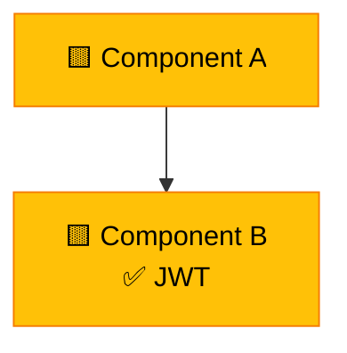

```markdown
## Notes

### 1️⃣ Component B - Auth Strategy ✅ RESOLVED
**Decision:** JWT
**Rationale:** Need stateless for horizontal scaling
**Trade-off:** More complex, but worth it for our use case
```

**Repeat until no red notes left.**

---

### Phase 3.5: Research/Validate (Test Against Knowledge)

**BEFORE turning everything yellow (approval):**

**After discussing red notes, we research the flow against bodies of knowledge:**

1. **AI identifies validation needs:**
   - Which decisions need validation?
   - What sources to consult? (books, docs, best practices)
   - What questions to ask?

2. **Research phase:**
   - Query relevant knowledge bases (librarian for books, web search, documentation)
   - Test assumptions against established patterns
   - Discover edge cases we missed
   - Find potential conflicts with principles/ethics

3. **Discovery cycle:**
   - Research findings may reveal NEW red notes (back to Phase 3)
   - Add new numbered notes (4️⃣, 5️⃣, etc.) for issues discovered
   - Discuss new findings
   - Iterate until validated

**Example:**

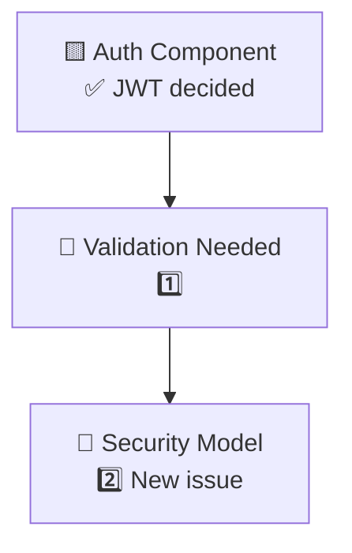

```markdown
## Research Findings

### 1️⃣ JWT Implementation - Needs Validation
**Question:** Does our JWT approach align with OWASP best practices?
**Sources to check:** Security books, OWASP docs, OAuth specs

### 2️⃣ Security Model - DISCOVERED ISSUE
**Finding:** OWASP recommends refresh tokens for web apps (we only planned access tokens)
**Source:** OWASP JWT Cheat Sheet
**Impact:** Security risk if access token expires while user active
**New decision needed:** Add refresh token flow?
```

**Flow:**
```
Phase 3 (Discuss) → Phase 3.5 (Research) → Back to Phase 3 (new reds)
                                        → Phase 4 (Approve - all validated)
```

**Rule:** Can't approve (yellow) until BOTH:
- All discussions resolved (red → yellow)
- All validations complete (tested against knowledge)

**Why this matters:**
- Catch misalignments BEFORE coding
- Surface unknown unknowns (issues we didn't think to ask)
- Validate against principles (VISION.md ethics, industry standards)
- Cheaper to iterate on diagram than on code

---

### Phase 4: Gray → Yellow (Approval)

**When all red notes resolved AND validated:**

1. Change ALL gray components → yellow
2. Yellow = APPROVED, ready to execute

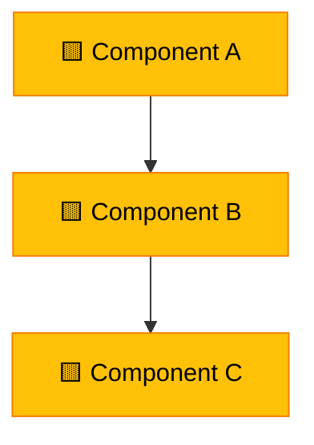

**At this point:**
- Commit + push
- User can leave (eat, sleep, work)
- AI executes implementation

---

### Phase 5: Yellow → Blue (Execution)

**As AI implements each component:**

1. Execute code/config for component
2. Test it works
3. Change component yellow → blue

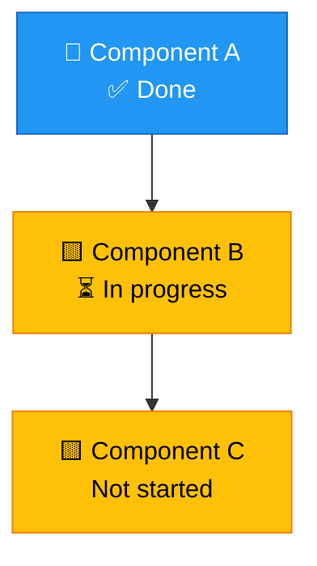

**Track progress visually in diagram.**

---

### Phase 6: Errors (Blue/Yellow → Red)

**If AI hits a roadblock during execution:**

1. Mark component red
2. Add numbered note (1️⃣) explaining:
   - What failed
   - Why it failed
   - What's needed (permission? decision? help?)

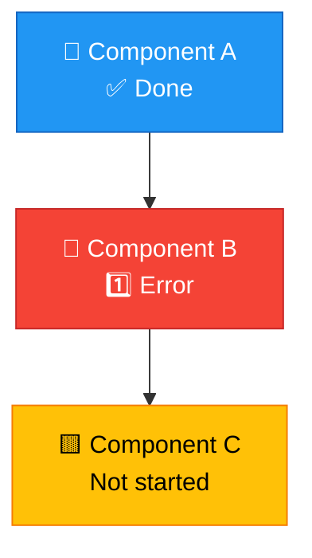

```markdown
## Errors

### 1️⃣ Component B - Auth Implementation Failed
**Error:** Cannot install `jsonwebtoken` package
**Reason:** Package.json doesn't exist yet
**Needed:** Should I create package.json first? Or use different JWT library?

**Waiting for decision.**
```

**Next day:** User sees diagram (blue, yellow, red), addresses red notes, AI continues

---

## Color Protocol Summary

| Color | Meaning | When to Use |
|-------|---------|-------------|
| ⚫ Gray | Draft Flow | Initial structure, not finalized |
| 🔴 Red | Discussion / Error | Needs decision OR hit roadblock |
| 🟨 Yellow | Approved / TODO | Ready to execute OR in queue |
| 🔵 Blue | Executed | Already implemented and working |

**Flow:**
```
Gray (structure) → Red (notes) → Yellow (approved) → Blue (executed)
                       ↓ (discuss)
                  Research/Validate → New Reds (back to discuss)
                       ↓ (if error during execution)
                     Red (roadblock) → resolve → Yellow → Blue
```

---

## Numbered Notes (1️⃣ 2️⃣ 3️⃣)

**When to use:**

**Pre-execution (design phase):**
- Questions that need discussion
- Trade-offs that need decisions
- Unclear requirements

**During execution:**
- Errors AI can't resolve alone
- Permission needed (destructive action, cost implications)
- Ambiguity in implementation

**Format:**

```markdown
### 1️⃣ [Component Name] - [Issue Title]
**Question/Error:** ...
**Context:** ...
**Options:** A, B, C
**Needed:** Decision / Permission / Help
```

**In diagram:**

```mermaid
A["🔴 Component<br/>1️⃣"]
```

**Notes without numbers = just explanations, turn yellow when approved.**

---

## Debugging Broken Diagrams

**If diagram breaks in Typora:**

1. User says: "diagrama quebrou"
2. AI tests on https://mermaid.live
3. AI fixes syntax
4. AI updates file
5. User reloads Typora

**NO localhost server, NO browser relay needed.**

Mermaid.live = fast syntax check.

---

## Example: Full Session

### Step 1: Create Structure (Gray)

**User:** "design webhook system for backstage"

**AI creates:** `epic-notes/webhook-architecture.md`

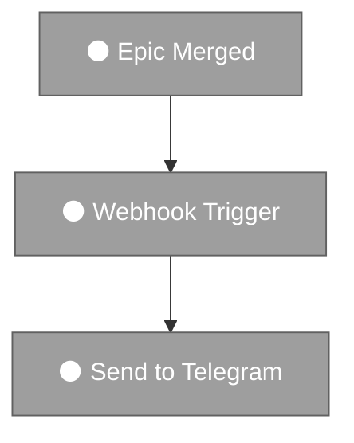

**User:** "looks good, add error handling"

**AI adds:**

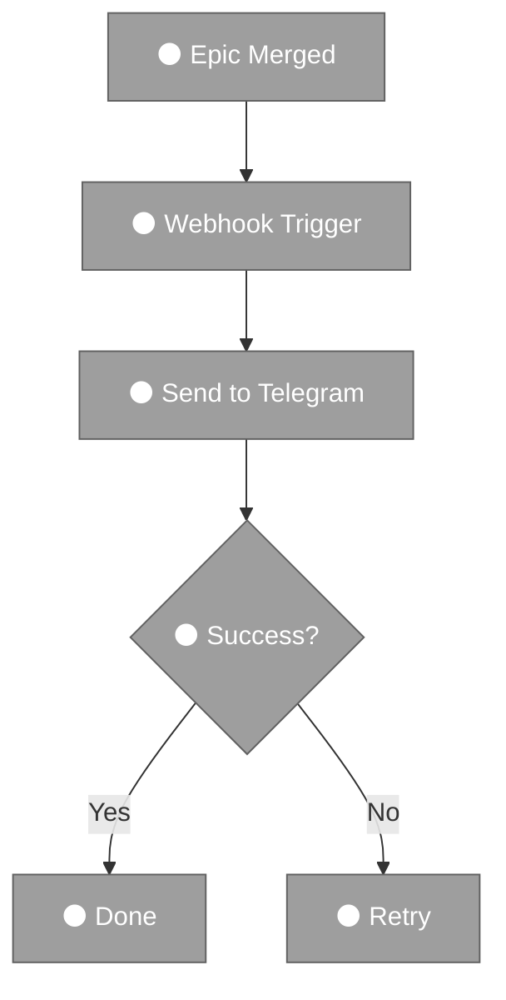

**User:** "flow looks good, move to notes"

---

### Step 2: Add Notes (Gray → Red/Yellow)

**AI adds discussion points:**

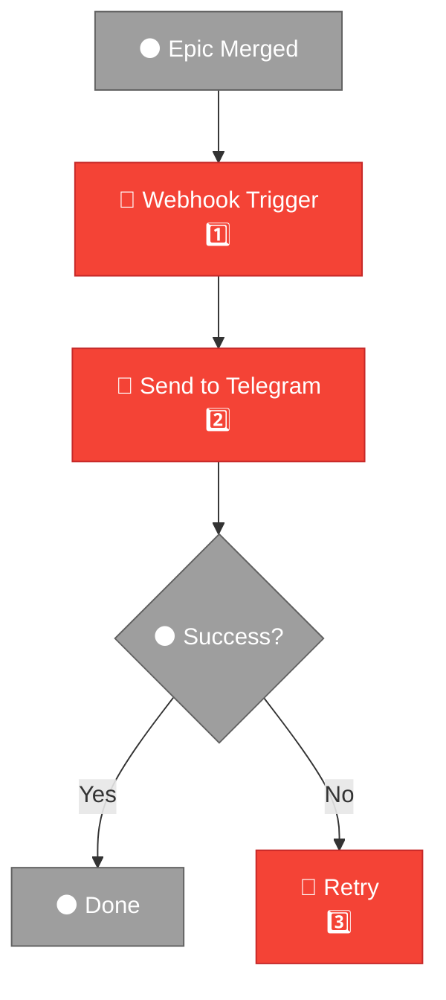

```markdown
## Notes

### 1️⃣ Webhook Trigger - Where to Hook?
**Question:** GitHub Actions webhook or post-merge script?
- GitHub Actions: Native, runs on GitHub
- Post-merge script: Local, need git hook

### 2️⃣ Send to Telegram - Store Token Where?
**Question:** Environment variable or config file?
- ENV: Secure, not in git
- Config: Easy, but need .gitignore

### 3️⃣ Retry - How Many Times?
**Question:** Retry strategy?
- 3 times with exponential backoff?
- Infinite with rate limit?
```

---

### Step 3: Discuss (Red → Yellow)

**User:** "GitHub Actions, env var, 3 retries exponential"

---

### Step 3.5: Research/Validate

**Before approval, AI validates decisions:**

**AI:** "Let me validate these choices against best practices..."

**Research queries:**
- Librarian: "GitHub Actions webhook best practices security"
- Librarian: "Telegram bot token storage recommendations"
- Web: "Exponential backoff retry strategies"

**Findings:**

```markdown
## Research Findings

### GitHub Actions Security ✅ VALIDATED
**Source:** GitHub Security Best Practices (web docs)
**Finding:** Webhook signatures recommended for production
**Impact:** Need to add HMAC signature validation
**New component needed:** Verify webhook signature before processing

### Telegram Token ✅ VALIDATED with ADDITION
**Source:** Telegram Bot API docs
**Finding:** Environment variables recommended + add rate limiting
**Impact:** Need to add rate limiter to prevent API quota exhaustion
**New component needed:** Rate limiter before Telegram API call

### Retry Strategy ✅ VALIDATED
**Source:** "Release It!" by Michael Nygard (Librarian chaos-engineering topic)
**Finding:** 3 retries exponential is standard, confirms our choice
**Impact:** No changes needed
```

**AI adds new components discovered through research:**

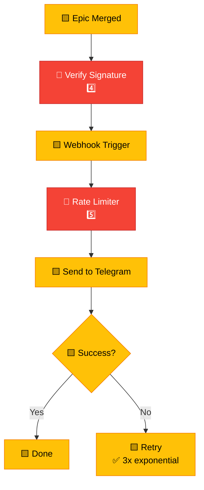

**New red notes to discuss:**

```markdown
### 4️⃣ Verify Signature - DISCOVERED via Research
**Question:** Should we use HMAC-SHA256 for webhook verification?
**Source:** GitHub Security Best Practices
**Options:**
- Skip (simple, but insecure)
- HMAC-SHA256 (standard, secure)

### 5️⃣ Rate Limiter - DISCOVERED via Research
**Question:** What rate limit strategy?
**Source:** Telegram Bot API docs (30 msgs/sec limit)
**Options:**
- Token bucket (smooth, complex)
- Fixed window (simple, bursty)
- No limiter (risky if webhook spam)
```

**User discusses new findings, approves additions:**

**User:** "HMAC yes, token bucket rate limiter"

**AI updates all → yellow:**

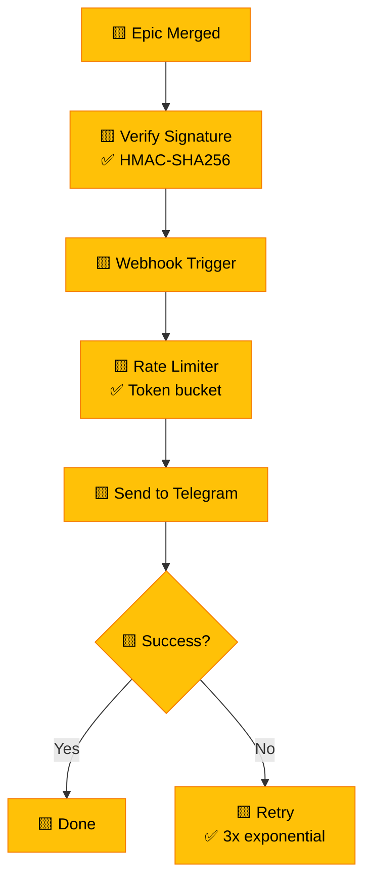

---

### Step 4: Approve (All Yellow + Validated)

**User:** "approved, commit and execute. going to dinner"

**AI updates:**

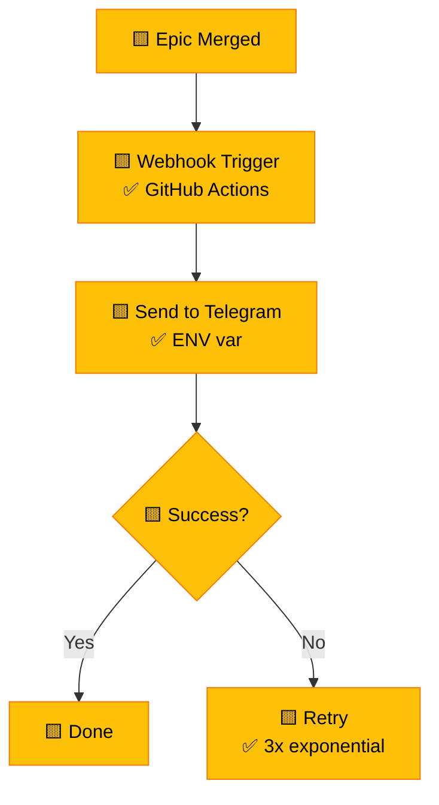

```markdown
## Notes

### 1️⃣ Webhook Trigger ✅ RESOLVED
**Decision:** GitHub Actions
**Rationale:** Native integration, runs on GitHub infra

### 2️⃣ Send to Telegram ✅ RESOLVED
**Decision:** Environment variable (TELEGRAM_BOT_TOKEN)
**Rationale:** Secure, not committed to git

### 3️⃣ Retry ✅ RESOLVED
**Decision:** 3 retries with exponential backoff (1s, 2s, 4s)
**Rationale:** Balance reliability vs not hammering Telegram API
```

---

### Step 4: Approve (All Yellow)

**User:** "approved, commit and execute. going to dinner"

**AI commits:**
```bash
git add epic-notes/webhook-architecture.md
git commit -m "docs: webhook architecture approved (all yellow)"
git push origin main
```

**User leaves. AI starts implementing.**

---

### Step 5: Execute (Yellow → Blue)

**AI implements each component, updates diagram:**

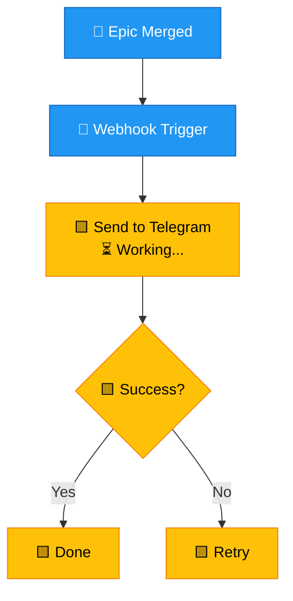

**If error happens:**

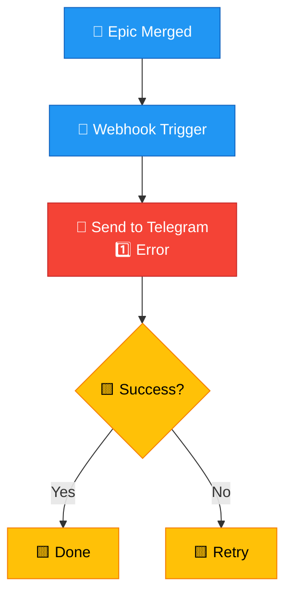

```markdown
## Execution Errors

### 1️⃣ Send to Telegram - Missing Token
**Error:** TELEGRAM_BOT_TOKEN not set in GitHub Secrets
**Context:** Tried to send test message, got 401 Unauthorized
**Needed:** User needs to add token to GitHub repo settings
**Next:** Once token added, I can continue
```

---

### Step 6: Next Day

**User returns, sees diagram:**
- 🔵 Blue = done
- 🟨 Yellow = waiting
- 🔴 Red = needs attention

**Addresses red notes, AI continues.**

**When all blue:**
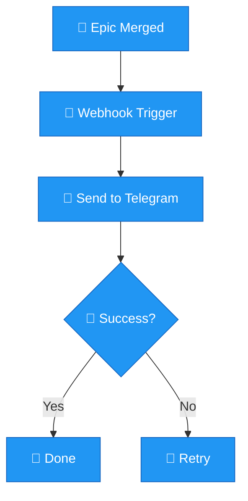

**Ready to test!**

---

## Commands

```bash
arch start [name]    # Create new architecture
arch list            # List saved architectures
arch open [name]     # Open in Typora
```

**AI handles the rest (updating diagram, tracking progress).**

---

## Integration with Backstage

**Add to ROADMAP:**
```markdown
- [ ] **Exercise:** Design [system] architecture (epic-notes/[name]-architecture.md)
```

**Workflow:**
1. User triggers design-architecture skill
2. Iterate until all yellow (approved)
3. Mark ROADMAP task done
4. AI executes (yellow → blue)
5. Reference in commits: `git commit -m "feat: webhook (see epic-notes/webhook-architecture.md)"`

---

## Why This Works

**Problem:** Code-first = expensive mistakes, rework, confusion

**Solution:** Design-first = validate with AI, iterate cheap (text), approve before coding, track execution visually

**Benefits:**
- ✅ Catch issues early (diagram discussion, not code refactor)
- ✅ Async collaboration (user approves, leaves, AI executes)
- ✅ Visual progress tracking (colors show status at a glance)
- ✅ Error transparency (red notes = roadblocks, not silent failures)
- ✅ Audit trail (v1 gray → v2 yellow → v3 blue = full history)

**Cost:** 30 min upfront design saves days of rework later.

---

**This protocol = CRITICAL. Don't lose this knowledge.** 🔒

---

## Critical Rules

### Rule 1: Numbered Note Parity (1️⃣ ↔ Notes)

**EVERY numbered emoji in diagram MUST have matching note below.**

**If diagram has:**
```mermaid
A["🔴 Component<br/>1️⃣"]
```

**Then notes MUST have:**
```markdown
### 1️⃣ Component - Issue Title
**Question/Error:** ...
```

**Parity works both ways:**

| Diagram | Notes | Meaning |
|---------|-------|---------|
| `🔴 Component<br/>1️⃣` | `### 1️⃣ Component - Question` | Red = needs discussion |
| `🟨 Component<br/>✅ Decision` | `### 1️⃣ Component ✅ RESOLVED` | Yellow = question answered |
| `🔵 Component<br/>✅ Done` | `### 1️⃣ Component ✅ IMPLEMENTED` | Blue = executed |

**Rule:** If you see 1️⃣ in diagram, scroll down and find matching note. If you see note without diagram emoji, ADD IT.

**Why:** Keeps diagram and docs in sync. No orphaned notes, no unexplained numbers.

---

### Rule 2: Color Consistency

**Components must match their state:**

- ⚫ Gray = draft (flow structure only)
- 🔴 Red = has numbered note (1️⃣ 2️⃣ etc) that needs resolution
- 🟨 Yellow = approved OR resolved question
- 🔵 Blue = implemented and working

**Don't mix:** Red component without numbered note = broken diagram.

---

### Rule 3: Update Both When Changing

**When resolving a red note:**

1. Update note (add ✅ RESOLVED, document decision)
2. Update diagram (red → yellow, change `1️⃣` to `✅ Decision`)
3. Commit both together

**When hitting error during execution:**

1. Update diagram (yellow/blue → red, add `1️⃣`)
2. Add matching note (## Execution Errors → ### 1️⃣ ...)
3. Commit both together

**Atomic updates = diagram always matches notes.**

---

### Rule 4: Research Before Approval (MANDATORY)

**NEVER approve (all yellow) without research/validation phase.**

**Before turning everything yellow:**

1. **AI must ask:** "Should I validate these decisions against our knowledge bases?"
2. **If yes:** Run research phase (Phase 3.5)
3. **If no:** User explicitly skips ("skip validation, I'm confident")

**Validation sources (format-agnostic):**
- **Books** (via librarian or equivalent semantic search)
- **Documentation** (official docs, RFCs, specs)
- **Best practices** (industry standards, OWASP, etc.)
- **Project principles** (VISION.md, SOUL.md, ethical constraints)

**What to validate:**
- Security decisions → Check against security literature
- Architecture patterns → Check against design pattern books
- API design → Check against REST/GraphQL best practices
- Database models → Check against data modeling principles
- Workflow logic → Check against business process patterns

**Discovery cycle:**
- Research findings → New red notes (4️⃣, 5️⃣, etc.)
- Discuss new findings → Resolve → Research again if needed
- Iterate until validated OR user explicitly accepts risk

**Why mandatory:**
- Diagrams = blueprints (wrong blueprint = expensive mistakes)
- Books/docs contain wisdom we don't have in context window
- Validation catches blind spots (things we didn't think to ask)
- Cheaper to discover issues in diagram than in production

**Example of skipping (explicit):**

**AI:** "Should I validate webhook security against best practices?"
**User:** "Skip validation, this is a prototype, not production"
**AI:** ✅ Proceeds to approval (documents skip in notes)

```markdown
## Validation

**SKIPPED** - User confirmed prototype scope, security validation deferred to production epic
```

---


## Documentation Protocol: SAME Document vs NEW Document

**When to UPDATE existing document (SAME):**

✅ **Same epic/project** - Adding to existing architecture
✅ **Evolving design** - Iterating on approved flow (gray → yellow → blue)
✅ **Implementation updates** - Turning yellow → blue (execution phase)
✅ **Error documentation** - Adding red notes during execution
✅ **Research findings** - Adding validation results to existing decisions

**When to CREATE new document (NEW):**

❌ **Different epic/project** - New architecture for different system
❌ **Alternative design** - Exploring different approach (save original)
❌ **Archive/reference** - Preserving old version before major redesign

---

## Enforcement Protocol

**When I detect "Arch: [topic]" trigger:**

1. **🔍 Check existing documents:**
   ```bash
   find epic-notes/ -name "*[topic]*architecture*.md"
   ```

2. **📋 Decision tree:**
   - **If document exists for this epic** → UPDATE SAME document
   - **If no document exists** → CREATE NEW document
   - **If ambiguous** → ASK USER before creating

3. **🚨 NEVER silently create new document** when existing one applies

4. **✅ Document continuation in commit:**
   ```bash
   git commit -m "arch: [topic] - [gray/yellow/blue] phase (updated existing)"
   ```

---

### Examples

**✅ CORRECT: Update Existing**

**Scenario:** Epic has `webhook-architecture.md`, you're adding retry logic

**Action:**
1. Open `webhook-architecture.md`
2. Update diagram (add retry component)
3. Add numbered note (🔴 1️⃣ Retry strategy?)
4. Discuss → resolve → turn yellow
5. Commit: `arch: webhook retry logic (added to existing)`

**❌ WRONG: Create New**

**Scenario:** Epic has `webhook-architecture.md`, you create `webhook-retry-architecture.md`

**Problem:**
- Split context (diagram ≠ docs)
- Lost continuity (can't see full flow)
- Duplicate effort (re-explain same system)

---

### When User Says "Arch: enforcement trigger"

**This means:**
> "Remind yourself: document on SAME file, not new ones. Think before creating."

**My response:**
1. ✅ Acknowledge protocol
2. 🔍 Check for existing arch docs
3. 📝 Update SAME doc if exists
4. 💬 Ask if unsure ("Should I update webhook-architecture.md or create new file?")

---

## Contract Stability = Communication Efficiency (CRITICAL)

**Arch violation creates noise at scale.**

**Three sources of noise:**
1. **Moving file** → "Where did the doc go?"
2. **Moving diagram** → "Which version is current?"
3. **Duplicating diagram** → "Which one is the contract?"

**Why stability matters:**
- **MANY people will see contract** (not just one person)
- Each change = explaining to EVERYONE
- **Communication cost scales:** 10 people × 3 changes = 30 explanations

**Metabolic cost:**
- Moving file → everyone asks "where is it?"
- Moving diagram position → everyone asks "where's the contract?"
- Duplicate diagram → everyone asks "which is truth?"

**Contracts are PUBLIC APIs:**
- Shared reference point (everyone looks at same thing)
- Muscle memory (always in same place)
- Single source of truth (no ambiguity)
- **Breaking contracts = breaking trust at scale**

**Parity = Communication efficiency:**
- ✅ **File stable** → No "where is it?" questions
- ✅ **Diagram stable** → No "which version?" questions
- ✅ **Position stable** → No "where's the contract?" questions

**Rules (NON-NEGOTIABLE):**

1. **One file per epic** (never create new md for same epic)
2. **One diagram** (edit existing, never duplicate)
3. **Diagram always at top** (position never changes)
4. **Edit in place** (add nodes, change colors, update text)

**If you change file, diagram, or position → NOISE. Lack of parity.**

**Memory anchor:** "Contract stability protects EVERYONE's time. Moving things = expensive communication tax."

**Example violation (v0.15.0-skill-protocol - 2026-02-12):**
- ❌ Created enforcement.md (new file)
- ❌ Created Runtime Flow diagram (duplicate)
- ❌ Moved diagram position (line 5 → 29 → 3)
- **Result:** Confusion, wasted time explaining, parity broken

**Corrected approach:**
- ✅ One file (protocol.md)
- ✅ One diagram (Sandwich Architecture original)
- ✅ Diagram on top (stable position)
- ✅ Edit in place (no duplication)

---

---

## Visual Communication > Text Explanation

**Users are VISUAL. Diagram edits = instant comprehension.**

**Principle:** "If user needs to READ to understand progress → you failed. Diagram should SHOW progress."

**Why visual aids matter:**
- **Diagram edit** → instant comprehension (no reading)
- **Text explanation** → cognitive load (must parse words)
- **Colors = status** → no need to read "this is broken"
- **Visual bandwidth** → process info faster than text

**Application:**
- ✅ Edit diagram colors (gray → blue = implemented)
- ✅ Add status markers (✅/🔴/⚫)
- ✅ Use numbered notes (1️⃣ 2️⃣) to link details
- ✅ Less words = more focus, more attention

**What users see:**
- **🔵 Blue node** = "this works" (instant)
- **🔴 Red node** = "this broken" (instant)
- **⚫ Gray node** = "not started" (instant)

**vs text:**
- "Component X is implemented and functional" (must read, parse, interpret)

**Design rule:** Visual first. Text for details only.

---

## Visual Diff = Async Collaboration

**Diagram colors = changelog. No reading required.**

**Scenario:**
- User sleeps
- AI works on epic (implements, tests, finds issues)
- User wakes up, opens Typora
- **Diagram colors changed:**
  - ⚫ Gray → 🔵 Blue = "AI implemented this"
  - 🟨 Yellow → 🔴 Red = "AI tried, broke"
  - New numbered notes (3️⃣ 4️⃣) = "AI found problems"

**User INSTANTLY knows:**
- ✅ What was done (blue nodes)
- ✅ What broke (red nodes)
- ✅ What needs discussion (numbered notes)

**WITHOUT reading a single word.**

**Why this works:**
- **Visual diff** → Colors = status delta
- **Async-friendly** → Work happens while user sleeps
- **Zero cognitive load** → Open file, already know
- **Instant status** → No need to read report/changelog

**Comparison:**

| Approach | User Experience |
|----------|----------------|
| **Visual diff (diagram colors)** | Open file → **already know** what happened |
| **Text report** | Open file → must read → must parse → then know |
| **New file** | Open file → **confused** (where's the contract?) |
| **Duplicate diagram** | Open file → **confused** (which is current?) |

**Why diagram = contract = sacred:**
- If AI moves file → user wakes up **confused**
- If AI duplicates diagram → user wakes up **confused**
- If AI edits diagram in place → user wakes up **informed**

**Design principle:** Async collaboration requires visual stability. User should wake up smarter, not more confused.

**Quote:** "num futuro, se eu acordar com ESSE contract update, cores diferentes, eu SABERIA o que aconteceu IMEDIATAMENTE"

**Memory anchor:** "Visual diff = async communication protocol. Diagram edits while user sleeps = progress visible on wake."

---

## Color Legend (Standard Palette)

**Use these colors consistently across all architecture diagrams.**

<table>
  <tr>
    <th></th>
    <th>Name</th>
    <th>Use this color when...</th>
  </tr>
  <tr>
    <td style="background-color: #CECECE; color: black; text-align: center; width: 60px; font-weight: bold; font-size: 18px;">1</td>
    <td>Neutral</td>
    <td>No agreement yet. Backlog, not discussed, not approved.</td>
  </tr>
  <tr>
    <td style="background-color: #FFE083; color: black; text-align: center; width: 60px; font-weight: bold; font-size: 18px;">2</td>
    <td>Approved</td>
    <td>Agreed by all stakeholders, ready for development. Sometimes has notes.</td>
  </tr>
  <tr>
    <td style="background-color: #FAB3AE; color: black; text-align: center; width: 60px; font-weight: bold; font-size: 18px;">3</td>
    <td>Blocker</td>
    <td>Either needs discussion to agree, OR failed implementation. <strong>Always with numbered note.</strong></td>
  </tr>
  <tr>
    <td style="background-color: #90CAF9; color: black; text-align: center; width: 60px; font-weight: bold; font-size: 18px;">4</td>
    <td>Developed</td>
    <td>Agreed and implemented. Ready for testing.</td>
  </tr>
  <tr>
    <td style="background-color: #FFCB7F; color: black; text-align: center; width: 60px; font-weight: bold; font-size: 18px;">5</td>
    <td>Developed*</td>
    <td>Agreed and implemented, but developer (AI) made decisions that warrant discussion.</td>
  </tr>
  <tr>
    <td style="background-color: #D7A8DF; color: black; text-align: center; width: 60px; font-weight: bold; font-size: 18px;">6</td>
    <td>Partial</td>
    <td>Some paths work, others don't. <strong>Use numbered note for details.</strong> Paths can have colors too.</td>
  </tr>
</table>

**Mermaid syntax:**
```
style NODE_NAME fill:#90CAF9,stroke:#64B5F6,color:#000
```

**Hex codes (for reference):**
- #1 Gray: `#CECECE` (stroke: `#9E9E9E`)
- #2 Yellow: `#FFE083` (stroke: `#FFB74D`)
- #3 Red (light pink): `#FAB3AE` (stroke: `#E57373`)
- #4 Blue (baby blue): `#90CAF9` (stroke: `#64B5F6`)
- #5 Orange: `#FFCB7F` (stroke: `#FF9800`)
- #6 Purple: `#D7A8DF` (stroke: `#BA68C8`)

**Transitions:**
- Gray → Yellow (approved/started)
- Yellow → Orange (implemented, needs testing)
- Yellow → Red (tried, failed/blocked)
- Orange → Blue (tested, works)
- Orange → Purple (partially works)
- Orange → Red (tested, broken)
- Red → Yellow (after fix/unblocked)
- Purple → Blue (all paths fixed)
- Purple → Red (too broken to continue)

**Why consistent colors:**
- Visual diff works across projects (same color = same meaning)
- User can scan ANY diagram and instantly know status
- No need to re-learn color scheme per project
- Async collaboration: colors changed = progress visible

---

---

## Arch vs Arch Note (Execution vs Documentation)

**Arch has two modes:**

**1. Arch (execute):**
- "Arch: create diagram for X"
- "Arch: design flow for Y"
- → AI creates diagram, code, files
- → AI executes and documents

**2. Arch note (document only):**
- "Arch note: we decided to use global legend"
- "Arch note: arrows can have colors"
- → AI writes decision in arch notes
- → AI does NOT execute
- → Wait for approval before execution

**Critical distinction:**
- **Arch** = do the thing
- **Arch note** = write about the thing (don't do it yet)

**Why this matters:**
- Documentation first = discuss before building
- Prevents premature execution
- Separates design decisions from implementation

**Example workflow:**
1. User: "Arch note: legend should be global"
2. AI: Documents decision in notes (doesn't create file)
3. User reviews notes
4. User: "Arch: implement global legend"
5. AI: Creates COLOR-LEGEND.md + updates contracts

**Memory anchor:** "Arch note = pen only. Arch = pen + hammer."

---

---

## Arch Note: Typora → HTML Localhost Wrapper

**Date:** 2026-02-12  
**Context:** CSS customization limitations in pure Markdown

**Decision:** Move from Typora-only Markdown to HTML localhost wrapper for contracts.

**Benefits:**
1. **More control:** Full CSS/JS customization of Mermaid diagrams
2. **Live reload:** Edit MD → auto-refresh in browser
3. **Debug:** Browser devtools for diagram inspection
4. **Other devices:** Access from iPad/iPhone via Tailscale (Typora = Mac only)
5. **Export:** Custom-styled PNG/SVG exports
6. **Portable:** Same pattern as agenda.html (proven workflow)

**Trade-offs:**
- Markdown still primary format (contracts written in .md)
- HTML = rendering layer (generated from MD)
- Typora still useful for quick edits
- Localhost server must be running (`python3 -m http.server`)

**Implementation pattern:**
```bash
# Similar to agenda.html
cd ~/Documents/librarian/backstage
python3 -m http.server 8765 &
open http://localhost:8765/contract.html
```

**Status:** Documented (not implemented yet)

---

---

## Arch Note: HTML Viewer Pattern - Dress the Viewer

**Date:** 2026-02-12  
**Context:** HTML localhost wrapper implementation strategy

**Pattern: "Dress the viewer with the contract"**

**How it works:**
1. **Consistent URL:** `http://localhost:8765/contract.html` (always same)
2. **Plug MD:** Point viewer to current contract exercise
3. **Ready:** Viewer renders whatever MD is loaded

**Trade-off accepted:**
- ❌ **Can't view multiple contracts simultaneously**
- ✅ **Never needed** (we work on ONE contract at a time)

**Mental model:**
- Viewer = dress/outfit (HTML wrapper, CSS, JS)
- Contract = body (MD content, specific exercise)
- We DRESS the viewer with the current contract

**Implementation:**
```bash
# Single viewer, swap content
contract.html?md=v0.15.0-skill-protocol.md
# or
ln -sf epic-notes/v0.15.0-skill-protocol.md current-contract.md
```

**Benefit:** Stable URL = bookmark, refresh works, device consistency.

**Status:** Documented (pattern decided)

---

---

## Arch Note: Diagram Template as Lego Blocks

**Date:** 2026-02-12  
**Context:** Reusable diagram structure for contracts

**Concept: Meta-diagram**

**Problem:** Each contract starts from scratch (copy theme init, colors, linkStyle, etc.)

**Solution:** Template diagram with:
- ✅ Theme variables (`%%{init: {...}}%%`)
- ✅ Color palette (style declarations)
- ✅ Arrow defaults (linkStyle)
- ✅ Common node types (decision diamonds, processes, outputs)
- ✅ Symbol conventions (🎤 skill, 👷 shell, ⚙️ python)

**Usage:**
1. Copy template
2. Replace node names + connections
3. Adjust colors per component state
4. Done (no reinventing styles)

**Benefits:**
- Consistency across all contracts
- Faster diagram creation (lego blocks)
- Single source for visual conventions
- Update template → propagate to new contracts

**Location (when created):**
- `~/Documents/skills/arch/DIAGRAM-TEMPLATE.md`
- Contracts copy + customize

**Status:** Documented (not created yet)

---

---

## Arch Note: Exercise Onboarding + Menu System

**Date:** 2026-02-12  
**Context:** HTML wrapper per-exercise customization

**Problem:** Each exercise needs contextual links/menu, but data collection is manual.

**Solution: Exercise onboarding + menu generation**

**Components:**

1. **Onboarding script** (beginning of exercise):
   - Collect: GitHub repo, Jira epic, docs links, slack channels, etc.
   - Store: `exercise-meta.json` per contract
   
2. **Menu rendering** (in HTML wrapper):
   - Read `exercise-meta.json`
   - Generate sidebar/header with links
   - Context-aware (repo, issues, docs, team)

3. **Template:**
```json
{
  "name": "v0.15.0 - Skill as Protocol",
  "repo": "https://github.com/user/librarian",
  "epic": "https://jira.company.com/browse/EPIC-123",
  "docs": ["https://link1", "https://link2"],
  "slack": "#librarian-dev",
  "team": ["@alice", "@bob"]
}
```

**Benefits:**
- Contextual navigation per exercise
- No lost links (collected upfront)
- Menu = data-driven (not hardcoded)
- Onboarding = forcing function (gather context first)

**Status:** Documented (not implemented yet)

---

---

## Arch Note: Exercise Detection - Master List vs Path Hardcoded

**Date:** 2026-02-12  
**Context:** How to discover/locate exercises for HTML wrapper

**Problem:** Multiple exercises, how does system know where they are?

**Option A: Master list**
```json
// ~/Documents/exercises.json
{
  "exercises": [
    {"id": "librarian-v0.15.0", "path": "librarian/backstage/epic-notes/v0.15.0-skill-protocol.md"},
    {"id": "fitness-v0.6.0", "path": "fitness/backstage/epic-notes/v0.6.0-tracker.md"}
  ]
}
```
- ✅ Central registry
- ✅ Easy to list all exercises
- ❌ Manual maintenance (add every exercise)
- ❌ Forgot to add = invisible

**Option B: Path hardcoded in URL**
```
http://localhost:8765/librarian/backstage/epic-notes/contract.html?md=v0.15.0-skill-protocol.md
```
- ✅ Self-describing (path = location)
- ✅ No central list to maintain
- ✅ Multiple exercises work independently
- ❌ URL changes per exercise (not "consistent")
- ✅ Each exercise = isolated (contract.html in same dir as MD)

**Decision:** DEFERRED (discuss when we talk about arch, not now)

**Current focus:** Librarian epic (arch helps, doesn't drive)

**Status:** Documented, not decided

---

---

## Arch Note: Flip Book - Contract Evolution Visualizer

**Date:** 2026-02-12  
**Context:** Visualize architecture contract changes over time

**Problem:** Contracts evolve (nodes turn blue, arrows added, blockers resolved). Hard to see progression without manual git diffs.

**Solution: Flip Book**

**Concept:**
- Timeline slider with git commits
- Drag slider → see contract at that commit
- Watch diagram animate (gray → yellow → blue)
- Bonus: playback mode (auto-advance through commits)

**Components:**

1. **Git integration:**
   - `git log --all --oneline -- contract.md` (get commit history)
   - `git show COMMIT:path/to/contract.md` (load MD at commit)
   
2. **Timeline UI:**
   - HTML5 range input (slider)
   - Commit markers on timeline
   - Commit messages tooltip on hover

3. **Render engine:**
   - Load MD → Marked → Mermaid render
   - CSS transitions between states (smooth color changes)
   - Diff highlighting (what changed this commit)

4. **Playback controls:**
   - Play/pause (auto-advance commits)
   - Speed control (commits/second)
   - Loop mode

**Bonus features:**
- **Diff view:** Side-by-side or overlay
- **Annotations:** Commit messages appear on diagram
- **Export:** GIF/video of progression

**Use cases:**
- Show stakeholders evolution (backlog → approved → developed)
- Debug regressions (when did this node turn red?)
- Portfolio piece (demonstrate iterative design)

**Status:** Documented (not implemented)

**Priority:** After basic wrapper works (v1.0 → v2.0 feature)

---

## Arch Note: Hot Reload Without Page Refresh

**Date:** 2026-02-12  
**Context:** Editing MD + viewing HTML requires reload (loses Chrome relay ON)

**Problem:** 
- Edit MD → save
- Reload HTML → loses ON badge
- Must re-enable relay every edit

**Solutions:**

**Option A: WebSocket live reload**
- Node.js script watches MD file
- On change → sends WebSocket event
- Browser JS receives → re-fetches MD → re-renders
- **NO page reload** (ON badge preserved)

**Option B: Browser extension auto-reconnect**
- Modify OpenClaw extension
- Detect page reload → auto-enable ON
- Transparent to user

**Option C: Split editor/preview**
- Left: Monaco editor (in-browser MD editor)
- Right: Live preview
- Edit → preview updates (no reload)

**Trade-offs:**
| Solution | Complexity | User Experience |
|----------|------------|-----------------|
| WebSocket | Medium | Seamless (no reload) |
| Extension mod | Low | Invisible (auto-ON) |
| Split editor | High | Best (integrated) |

**Recommendation:** Start with WebSocket (medium effort, big UX win).

**Status:** Documented (not implemented)

**Priority:** After Mermaid rendering fixed (quality of life feature)

---

---

## Arch Note: Edit Workflow (Commit → Edit → Reload)

**Date:** 2026-02-12  
**Context:** Contract evolution tracking + live preview

**Problem:** 
- Flipbook needs git history to visualize changes
- Edits invisible until wrapper reloads

**Rule:** Edit workflow = 3 steps:
1. ✅ **Commit before edit:** Current state saved (history frame)
2. ✅ **Edit contract.md:** Make changes
3. ✅ **Reload wrapper:** `cp contract.html + open in browser`

**Bad pattern:**
```bash
# Edit contract.md multiple times without commits
# → Lost intermediate states
# → Flipbook can't show progression
# → Changes invisible (forgot to reload wrapper)
```

**Good pattern:**
```bash
# 1. Commit before editing
git commit -am "contract: Before adding METADATA node"

# 2. Edit contract.md
vim v0.15.0-skill-protocol.md

# 3. Reload wrapper (copy + open)
cp ~/.openclaw/skills/arch/templates/contract-wrapper.html \
   ~/Documents/librarian/backstage/epic-notes/contract.html
open -a "Google Chrome" "http://localhost:8765/contract.html?md=v0.15.0-skill-protocol.md"
```

**Why:**
- **Commits = flipbook frames** (each edit captured)
- **Wrapper = live render** (see diagram immediately)
- **Workflow = muscle memory** (commit → edit → reload)

**Future:** Could automate with file watcher (inotify/fswatch).

**Status:** Documented (manual workflow, not automated yet)

---
