# Design Discrepancy Skill

**Nickname:** `discrepancy:`

**Objective:** Compare reference documentation (Figma, specs) with live system (via Relay ON), surface discrepancies for report.

---

## Workflow Diagram

```mermaid
flowchart TD
    1["1<br/>Trigger + exercise name 2️⃣"]
    2{"2<br/>Detects if exercise exists"}
    3["3<br/>Loads exercise MD 1️⃣"]
    4["4<br/>Creates new exercise MD<br/>from template"]
    5["5<br/>Asks critical info 3️⃣"]
    5a["5a<br/>Checks access to each<br/>critical point, updates table 4️⃣"]
    6["6<br/>Component inventory 5️⃣"]
    6a["6a<br/>Document matching 6️⃣"]
    6b{"6b<br/>Loop thru list"}
    7["7<br/>Discrepancy checks 7️⃣"]
    8["8<br/>Document deltas 8️⃣"]
    9["9<br/>Review findings"]
    13["13<br/>Informs of<br/>past and next phases"]
    
    1 --> 2
    2 -->|No exercise found| 4
    2 -->|Exercise found| 3
    
    4 --> 3
    3 --> 13
    13 --> 5
    
    5 --> 5a
    5a --> 6
    6 --> 6a
    6b --> 7
    7 --> 8
    8 --> 6b
    8 --> 9
    
    style 5 fill:#E8F5E9
    style 6 fill:#FFF9C4
    style 7 fill:#FFECB3
    style 8 fill:#E1F5FE
    style 11 fill:#FCE4EC
    style 10 fill:#C8E6C9
```



**Notes:**

**1️⃣ Loads exercise MD:** Opens in Typora for parity

**2️⃣ Trigger + exercise name:** Where do we keep track of exercise name and corresponding MD? Can user ask for list?

**3️⃣ Asks critical info:** Anything under [brackets] in template. Skill knows: date, status.

**4️⃣ Checks access:** Verify access to Figma API, Jira API, Relay ON, etc. Add "Connection" column to Documents table.

**5️⃣ Component inventory:** Runs over each page on system, finds all components and subcomponents, lists them on MD in ordered list.

**6️⃣ Document matching:** Matches all components found against documentation, renames according to documentation. Lists all components not part of documentation (icons, etc). Use `- [ ]` checkbox format. Add progress tracker (e.g., "3 of 12 completed").

**7️⃣ Discrepancy checks:** Run 3 tests per component: System vs Docs, WCAG 2.2, States. **Only document if tests fail. If pass, no delta.**

**8️⃣ Document deltas:** Add row to Excel with columns below, **check component on MD** (`- [x]`), **update Progress** (e.g., "4 of 12 completed"). Then loop back to 6b.
- **ID** (sequential)
- **Title** (brief description)
- **Jira task** (linked if related)
- **Priority** (blank)
- **Status** (default: "To triage")
- **Description** (why discrepancy exists, A→B: system/docs, docs/WCAG, etc)
- **Library version** (Figma link)
- **System version** (all page links where discrepancy found)
- **System image** (screenshot if needed)
- **Proposed solution** (blank)
- **Pattern alignment notes** (blank)

---

## When to Use

**Trigger patterns:**
- "compare X with Y"
- "check discrepancies between..."
- "design vs implementation"
- "Figma vs live site"
- Any reference ↔️ live system comparison

**Suggestion conditions:**
- User mentions differences between design and code
- Design review needed
- Component audit requested
- Quality assurance for design system

---

## Phase Details

*See workflow diagram above for complete flow. Details per phase:*

### Phase 1: Environment

**Ask for files, check connections/parity, create MD for documentation.**

**Steps:**
1. **Ask for reference:** Figma link? Documentation URL?
2. **Ask for live system:** Relay ON? Environment URL? Credentials?
3. **Ask for MD:** Does exercise MD exist? Where?
4. **Check connections/parity:** Review `~/.openclaw/workspace/connections/` for relevant info
5. **Create/update MD:** Add all links (reference, live system, reports, Excel)

**Template for MD:**
```markdown
## 📁 Documents (4 Sources)

**Reference (Documentation):**
- [Figma/Docs]: [URL]

**Live System:**
- [Environment]: [URL]
- [Access]: [credentials/relay status]

**Reports:**
- Markdown: [path to this file]
- Excel: [path to Excel file]
- Excel History: [history folder] (max 10 backups)
```

---

### Phase 2: Matching

**Per system page, detect components, list them. User will edit list.**

**Steps:**
1. **Per page in live system:**
   - Inspect DOM (if Relay ON)
   - Take screenshot (if needed)
   - List all visible components

2. **Organize components by scale:**
   - **Macro:** Page layout, grid, sections
   - **Meso:** Component groups (tabs, forms, accordions)
   - **Micro:** Individual elements (buttons, inputs, text)

3. **Output component list in MD:**
   ```markdown
   ## Components Found (Page: [name])
   
   ### Macro
   - [ ] Page header
   - [ ] Main grid layout
   - [ ] Footer
   
   ### Meso
   - [ ] Tab navigation
   - [ ] Form group
   - [ ] Data table
   
   ### Micro
   - [ ] Primary button
   - [ ] Input field
   - [ ] Label text
   ```

4. **User edits list:** Add/remove components, confirm scope

---

### Phase 3: Investigate

**Per each component on the list, investigate discrepancies between system and documentation.**

**Properties to check:**
- **Color:** Background, text, border (compare hex/rgb)
- **Font:** Family, weight
- **Font size:** px/rem/pt
- **Spacing:** Padding, margin
- **Spacing between objects:** Gap, grid spacing
- **States:** Hover, active, disabled, focus (simulate how? ⚠️ QUESTION)

**Steps:**
1. **For each component:**
   - Get reference specs (Figma/docs)
   - Get live system computed styles (Relay → `getComputedStyle()`)
   - Compare properties
   - Document differences

2. **How to simulate states?** ⚠️
   - Hover: Trigger via DevTools?
   - Active: Click and inspect?
   - Disabled: Toggle attribute?
   - Focus: Tab navigation?
   - **User confirm method per exercise**

3. **Log discrepancies:**
   - Component name
   - Property (color, spacing, etc.)
   - Expected (reference)
   - Actual (live system)
   - Impact (minor/major/critical)

---

### Phase 4: Document

**In MD, document all findings. DO NOT touch Excel unless explicitly asked.**

**Workflow:**
1. **List findings in MD** (brief, systematic)
2. **User reviews MD**
3. **User decides** what goes to Excel (if anything)
4. **If asked:** Assist with Excel EXACTLY as requested

**Format in MD:**
```markdown
## 📊 Discrepancies Found

### [Page Name]

#### [Component Name]
- **Property:** [color/spacing/font/etc]
- **Expected (docs):** [value from Figma]
- **Actual (system):** [value from Relay]
- **Impact:** [minor/major/critical]

[Repeat per component]
```

**Excel Rules:**
- ❌ **DO NOT** auto-populate Excel
- ❌ **DO NOT** assume what user wants
- ✅ **ONLY** do EXACTLY what's asked
- ✅ **ASK** if unclear what to add

**Column References (for when asked):**
- **Jira task:** Check `connections/jira.md`, use `=HYPERLINK(url, "CODE: TITLE")`
- **Library version:** Figma API via `connections/figma.md`, use `=HYPERLINK(url, "FILE: PAGE")`
- **System version:** URL from Relay ON, use `=HYPERLINK(url, "PAGE_NAME")`

---

### Phase 5: Excel (May Change)

**Assist user with Excel (images, formulas) if asked.**

**Tasks:**
- Insert images (screenshots, comparisons)
- Write formulas (if needed)
- Format cells
- Backup workflow (see `connections/excel-onedrive.md`)

**Workflow:**
1. Duplicate active file → history folder
2. Edit active file
3. Kill Excel + reopen
4. Cleanup history (keep last 10)

---

## 📋 TODO / Roadmap

### ⚠️ Open Questions

- [ ] **How to simulate component states?** (Phase 3)
  - Hover (DevTools trigger? CSS pseudo-class?)
  - Active (click and inspect?)
  - Disabled (toggle attribute in DOM?)
  - Focus (tab navigation?)
  - **Action:** Research methods, test with Relay ON, document findings

### 🔧 Improvements Needed

- [ ] **Phase 4 syntax finalization** (user working on it)
  - Define exact format for "Discrepancies Found"
  - Excel column descriptions (what goes in each)
  - MD vs Excel split (what's brief, what's detailed)

- [ ] **Phase 5 may change** (Excel workflow)
  - Confirm if Excel stays in workflow
  - Alternative: All-MD approach?
  - Keep monitoring user preference

### 💡 Future Enhancements

- [ ] **Automation ideas:**
  - Screenshot comparison (visual diff tools?)
  - Computed styles extraction script
  - Figma API integration (auto-fetch specs)

- [ ] **Template refinement:**
  - Add more MD templates per exercise type
  - Component checklist templates (per UI pattern)

---

## MD Template (New Exercise)

```markdown
# [Project] Design Discrepancy Exercise

**Date:** [YYYY-MM-DD]
**Participants:** [Names]
**Status:** [IN PROGRESS / COMPLETE]

---

## 📁 Documents (4 Sources)

**Map (Design):**
- [Design source]: [URL]

**Territory (Live System):**
- [Environment]: [URL]
- [Access]: [credentials/method]

**Reports:**
- Markdown: [path to this file]
- Excel: [path to Excel file]
- Excel History: [history folder] (max 10 backups)

---

## 🎯 Objective

[Brief description of what's being compared and why]

---

## 📋 Process

### 1. Map Analysis
[How to review design source]

### 2. Territory Analysis
[How to review live system]

### 3. Comparison
[Systematic approach]

### 4. Documentation
[Where findings go]

---

## 📊 Discrepancies Found

### Columns (Excel Schema)

[List Excel columns with brief descriptions]

---

## ✅ Next Steps

[What happens next]

---

*Document created: [date]*
*Last updated: [date]*
```

---

## Excel + History Workflow

**See:** `~/.openclaw/workspace/connections/excel-onedrive.md`

**Summary:**
1. Duplicate active file → history folder (with timestamp)
2. Edit active file (NOT timestamped copy)
3. Kill Excel + reopen (force reload)
4. Cleanup history (keep last 10)

**History folder structure:**
```
File.xlsx                    ← Active file
File history/                ← Backups
  File-20260210-095530.xlsx
  File-20260210-101245.xlsx
  (max 10, delete oldest)
```

---

## Key Rules

1. **ALWAYS ask for 2 sources** (reference + live system)
2. **ALWAYS ask for exercise MD** (or create)
3. **Document sources BEFORE comparing**
4. **Systematic approach** (macro → meso → micro)
5. **MD = brief, Excel = detailed**
6. **This is Wiley work** (not procrastination)
7. **🔴 READ-ONLY:** Do NOT change system or documentation (Figma, SIT, etc.) - observation only
8. **EDIT ONLY:** Exercise MD (findings, component lists, etc.)

---

## Examples

### Good Flow
```
User: "discrepancy: compare RPM Figma with SIT"

Me: "discrepancy: Preciso de:
     1. Figma link (mapa)
     2. Chrome Relay ON? (território)
     3. Onde está o MD desse exercício?"

User: [provides info]

Me: [opens MD, documents sources, starts comparison]
```

### Bad Flow (Don't Do This)
```
User: "compare design with code"

Me: [starts comparing without asking for sources]
❌ WRONG - no sources documented!
```

---

**Created:** 2026-02-10  
**Location:** `~/.openclaw/skills/design-discrepancy/SKILL.md`
