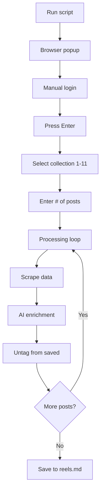
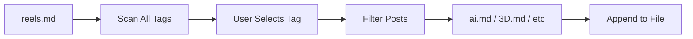
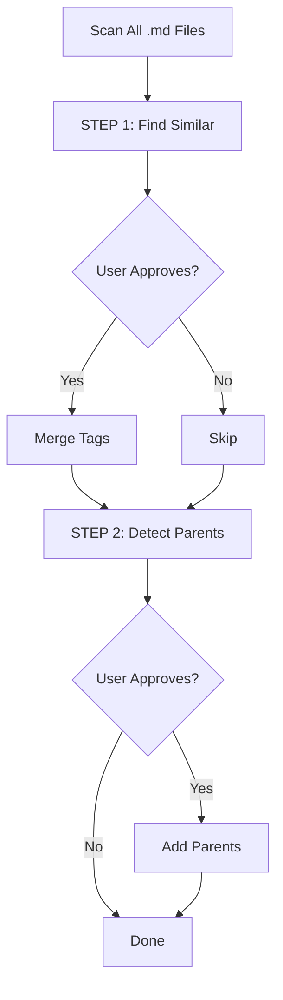

# Reels Library

Automated workflow for scraping, enriching, and organizing Instagram saved posts.

---

## 📋 Scripts Overview

### ✅ Active Scripts

| Script                                       | Purpose                                                         | Command                                                               | Flags     |
| -------------------------------------------- | --------------------------------------------------------------- | --------------------------------------------------------------------- | --------- |
| **[reels_library.py](reels_library.py)**     | All-in-one processor: scrape → enrich → untag in single session | `/opt/homebrew/bin/python3.11 tasks/reels-library/reels_library.py`   | `--batch` |
| **[sort_reels_tags.py](sort_reels_tags.py)** | Split reels.md into topic files by tags (e.g., #ai → ai.md)     | `/opt/homebrew/bin/python3.11 tasks/reels-library/sort_reels_tags.py` |           |
| **[manage_tags.py](manage_tags.py)**         | Tag cleanup: merge similar + add parent hierarchy               | `/opt/homebrew/bin/python3.11 tasks/reels-library/manage_tags.py`     |           |
| **[login.py](login.py)**                     | Shared login utility (imported by other scripts)                | _Not run directly_                                                    |           |

### ⚠️ Deprecated Scripts

| Script                          | Original Purpose                           | Replacement      |
| ------------------------------- | ------------------------------------------ | ---------------- |
| **scrape_reels_deprecated.py**  | Scrape Instagram saved posts               | reels_library.py |
| **enrich_reels_deprecated.py**  | AI enrichment (titles, hashtags, language) | reels_library.py |
| **untag_reels_deprecated.py**   | Remove posts from saved collection         | reels_library.py |
| **process_reels_deprecated.py** | Orchestrate scrape → enrich → untag        | reels_library.py |

> **Note:** Deprecated scripts safe to delete. All functionality merged into reels_library.py.

---

## 📖 Documentation

### reels_library.py

**Purpose:** All-in-one Instagram saved posts processor

**Workflow:**

1. Manual login → headless browser transfer
2. Scrape posts from selected saved collection (1-11)
3. AI enrichment: titles, language tags, dates, author usernames, hashtags
4. Untag from Instagram saved
5. Save to `links/reels.md` with pyperclip backup

**Command:**

```bash
/opt/homebrew/bin/python3.11 tasks/instagram/reels_library.py
```

**Diagram:**



**Processing time:** ~5-10 seconds per post

**Dependencies:**

- `undetected-chromedriver`
- `selenium`
- `langdetect`
- `pyperclip`

**Output example:**

```markdown
- [reason Japanese expelled all Westerners in 17th](https://www.instagram.com/p/DS4YY6nEReK/) @the_smart_cookies_pod #en-US #2025-12-30 #interesting-history #japanesehistory #japan
- [Americans worried about every country but their](https://www.instagram.com/p/DSffPF3AJuX/) @lexlos3r #en-US #2025-12-20 #interesting-history #politics
```

**Full documentation:** [content/ideas/reels-library.md](../../content/ideas/reels-library.md)

---

### sort_reels_tags.py

**Purpose:** Split reels.md into topic-based files by tags

**How it works:**

- Scans all tags in `links/reels.md`
- Excludes system tags (lang, date, #untag, #enrich)
- Interactive tag selection
- Auto-appends to existing files

**Command:**

```bash
/opt/homebrew/bin/python3.11 tasks/instagram/sort_reels_tags.py
```

**Example:**

- All `#ai` posts → `links/ai.md`
- All `#3D` posts → `links/3D.md`
- All `#craft` posts → `links/craft.md`

**Diagram:**



---

### manage_tags.py

**Purpose:** Two-step tag cleanup workflow

**STEP 1: Merge Similar Tags**

- Auto-detects variations: `#ai`, `#AI`, `#Ai` → `#ai`
- Handles plurals: `#craft`, `#crafts` → `#craft`
- Removes hyphens: `#design-`, `#design` → `#design`
- User approval for each merge

**STEP 2: Add Parent Tag Hierarchy**

- Detects parent-child: `#3D-printing` → adds `#3D` parent
- Detects compounds: `#aitools` → adds `#ai` parent
- Preserves tag order: lang, date, parents, others
- User approval for each parent

**Command:**

```bash
/opt/homebrew/bin/python3.11 tasks/instagram/manage_tags.py
```

**Scope:** All `.md` files in `links/` folder

**Diagram:**



---

## 🧩 Integration (Future)

This project could benefit from MGMT's workflow structure:

**Candidate Groups:**

- ✅ **reels-library** - Clear epics (scrape, enrich, tag management), versioning needed for API changes
- ✅ **library** - Book organization has data schema changes (metadata fields)
- ✅ **content** - Comics/literature sync has clear feature roadmap
- ⚠️ **media** - Mostly one-off scripts, less need for epic tracking
- ⚠️ **airtable** - Simple sync scripts, stable APIs
- ⚠️ **system** - Utility scripts, minimal evolution
